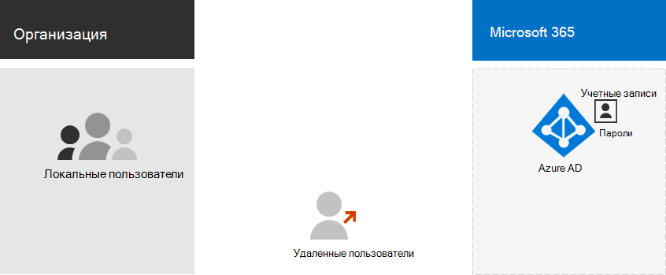
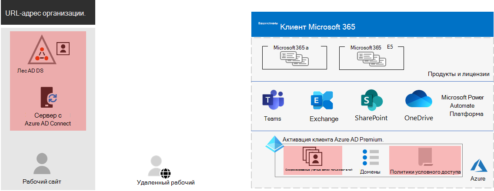
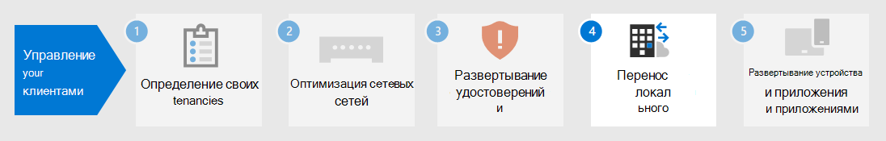

# Шаг 3. Удостоверение для клиентов Microsoft 365 для предприятий

Клиент Microsoft 365 включает клиент Azure Active Directory (Azure AD) для управления удостоверениями и проверкой подлинности для входов. Правильная настройка инфраструктуры удостоверений очень важна для управления доступом пользователей Microsoft 365 и разрешениями для вашей организации.

## Только облачные и гибридные

Вот два типа моделей удостоверений, их наилучшее подгонка и преимущества.

| Модель | Description | Проверка подлинности учетных данных пользователей в Microsoft 365 | Оптимально для. | Наибольшее преимущество |
|:-------|:-----|:-----|:-----|:-----|
| Только облако | Учетная запись пользователя существует только в клиенте Azure AD для клиента Microsoft 365. | Клиент Azure AD для клиента Microsoft 365 выполняет проверку подлинности с помощью облачной учетной записи удостоверения. | Организации, которые не имеют или не нуждаются в локальной AD DS. | Простое в использовании. Дополнительные средства или серверы каталогов не требуются. |
| Гибридная среда |  Учетная запись пользователя существует в локальной доменной службе Active Directory (AD DS), а копия также находится в клиенте Azure AD для клиента Microsoft 365. Azure AD Connect работает на локальном сервере для синхронизации изменений AD DS с клиентом Azure AD. Учетная запись пользователя в Azure AD также может включать в себя версию с уже схващенным паролем учетной записи пользователя AD DS. | Клиент Azure AD для клиента Microsoft 365 обрабатывает процесс проверки подлинности или перенаправляет пользователя к другому поставщику удостоверений. | Организации, использующие AD DS или другого поставщика удостоверений. | Пользователи могут использовать те же учетные данные при доступе к локальному или облачному ресурсу. |
||||||

Вот основные компоненты облачной идентификации.
 

На этом рисунке пользователи локальной и удаленной службы во входе с помощью учетных записей в клиенте Azure AD клиента Microsoft 365.

Вот основные компоненты гибридной идентификации.

На этом рисунке пользователи локальной и удаленной службы во время входов в клиент Microsoft 365 с помощью учетных записей в клиенте Azure AD, скопированные из локальной службы AD DS.

## Синхронизация локальной AD DS

В зависимости от бизнес-потребностей и технических требований гибридная модель удостоверений и синхронизация службы каталогов — это наиболее распространенный вариант для корпоративных клиентов, которые принимают Microsoft 365. Синхронизация службы каталогов позволяет управлять удостоверениями в AD DS, а все обновления учетных записей пользователей, групп и контактов синхронизируются с клиентом Azure AD клиента Microsoft 365.

>[!Note]
>Когда учетные записи пользователей AD DS синхронизируются в первый раз, им не будет автоматически назначена лицензия Microsoft 365 и они не смогут получить доступ к службам Microsoft 365, таким как электронная почта. Сначала необходимо назначить им место использования. Затем назначьте лицензию этим учетным записям пользователей по отдельности или динамически через членство в группах.
>

Вот два типа проверки подлинности при использовании гибридной модели удостоверений.

| Тип проверки подлинности | Description |
|:-------|:-----|
| Управляемая проверка подлинности. | Azure AD обрабатывает процесс проверки подлинности с помощью локально сохраненной версии пароля с использованием hashed или отправляет учетные данные локальному агенту программного обеспечения для проверки подлинности локальной службой AD DS.      Существует два типа управляемой проверки подлинности: синхронизация хеширования паролей (PHS) и сквозная проверка подлинности (PTA). С помощью PHS Azure AD выполняет проверку подлинности самостоятельно. С помощью PTA azure AD имеет AD DS для выполнения проверки подлинности. |
| Федеративная проверка подлинности | Azure AD перенаправляет клиентский компьютер, запрашивающий проверку подлинности, другому поставщику удостоверений. |
|  |  |

См. выбор правильного метода [проверки подлинности,](https://docs.microsoft.com/azure/active-directory/hybrid/choose-ad-authn) чтобы узнать больше.

## Принудительное применение строгого входов

Чтобы повысить безопасность входов пользователей, используйте функции и возможности, которые представлены в следующей таблице.

| Возможность | Описание | Дополнительные сведения | Требования к лицензированию |
|:-------|:-----|:-----|:-----|:-----|
| Windows Hello для бизнеса | Заменяет пароли на надевую двух коэффициентную проверку подлинности при входе на устройстве с Windows. Два фактора — это новый тип учетных данных пользователей, который связан с устройством и биометрией или ПИН-кодом. | [Общие сведения о Windows Hello для бизнеса](https://docs.microsoft.com/windows/security/identity-protection/hello-for-business/hello-overview) | Microsoft 365 E3 или E5 |
| Защита паролем Azure AD | Обнаруживает и блокирует известные слабые пароли и их варианты, а также может блокировать дополнительные слабые термины, специфические для вашей организации. | [Настройка защиты паролем Azure AD](https://docs.microsoft.com/azure/active-directory/authentication/concept-password-ban-bad) | Microsoft 365 E3 или E5 |
| Используйте многофакторную проверку подлинности (MFA) | Для многофаксной проверки необходимо, чтобы для входов пользователей требовалось дополнительная проверка помимо пароля учетной записи пользователя, например проверка с помощью приложения для смартфона или sms-сообщения, отправленного на смартфон. Инструкции [по настройкам](https://support.microsoft.com/office/set-up-multi-factor-authentication-in-microsoft-365-business-a32541df-079c-420d-9395-9d59354f7225) MFA пользователями см. в этом видео. | [MFA для Microsoft 365 для предприятий](../enterprise/microsoft-365-secure-sign-in.md#mfa) | Microsoft 365 E3 или E5 |
| Конфигурации доступа для удостоверений и устройств | Параметры и политики, которые состоят из рекомендуемых предварительных компонентов и их параметров в сочетании с политиками условного доступа, Intune и Azure AD Identity Protection, которые определяют, следует ли предоставлять запрос на доступ и при каких условиях.  | [Конфигурации доступа для удостоверений и устройств](../security/office-365-security/microsoft-365-policies-configurations.md) | Microsoft 365 E3 или E5 |
| Защита идентификации Azure AD | Защита от компрометации учетных данных, когда злоумышленник определяет имя и пароль учетной записи пользователя для получения доступа к облачным службам и данным организации. | [Защита идентификации Azure AD](https://docs.microsoft.com/azure/active-directory/active-directory-identityprotection) | Microsoft 365 E5 или Microsoft 365 E3 с удостоверением & Threat Protection |
|  |  |  |

## Результаты шага 3

Для идентификации клиента Microsoft 365 вы определили:

- Используемая модель удостоверений.
- Как вы будете применять мощный доступ пользователей и устройств.

Вот пример клиента с выделенной новой гибридной идентификацией.

На этой иллюстрации клиент имеет:

- Лес AD DS, который синхронизируется с клиентом Azure AD с помощью сервера DirSync и Azure AD Connect.
- Копия учетных записей пользователей AD DS и других объектов из леса AD DS.
- Набор политик условного доступа для применения безопасных входов пользователей и доступа на основе учетной записи пользователя. 

## Текущее обслуживание удостоверений

На постоянной основе может потребоваться:

- Добавление или изменение учетных записей пользователей и групп. Для облачного удостоверения вы поддерживаете облачных пользователей и группы с помощью средств Azure AD, таких как Центр администрирования Microsoft 365 или PowerShell. Для гибридной идентификации вы поддерживаете своих пользователей и группы в локальной организации с помощью средств AD DS.
- Добавьте или измените конфигурацию доступа к удостоверениям и устройствам, чтобы обеспечить соблюдение требований безопасности при входе.

## Следующий шаг

Продолжите [миграцию,](tenant-management-migration.md) чтобы перенести свои серверы Office и их данные в Microsoft 365.
