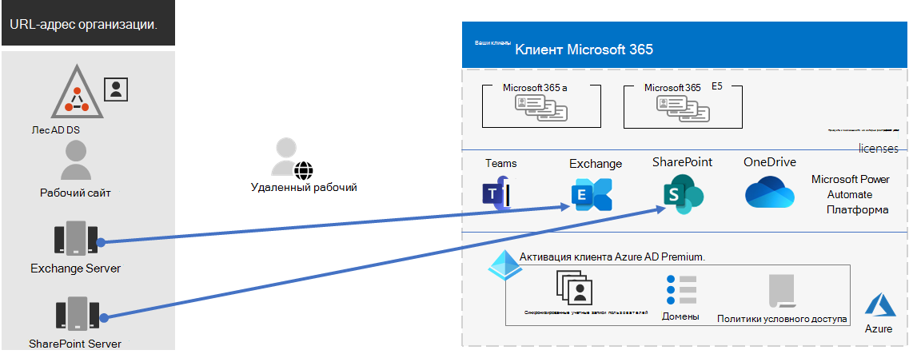
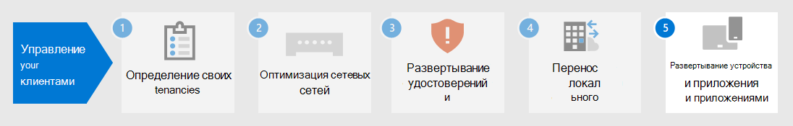

# Этап 4. Миграция для клиентов Microsoft 365 для предприятий

В большинстве корпоративных организаций имеется разнородная среда, включающая несколько выпусков операционных систем, клиентского программного обеспечения и серверного программного обеспечения. Microsoft 365 для предприятий включает наиболее безопасные версии ключевых компонентов ИТ-инфраструктуры. Он также включает функции повышения производительности, предназначенные для использования облачных технологий.

Чтобы максимально повысить ценность пакета корпоративных интегрированных продуктов Microsoft 365 для предприятий, начните планировать и внедрять стратегию переноса этих выпусков:

| From | To |
|:-------|:-----|
| Windows 7 и Windows 8.1 | Windows 10 Корпоративная |
| Клиентские продукты Office, установленные на устройствах сотрудников | Приложения Microsoft 365 для предприятий |
| Серверные продукты Office, установленные на локальном сервере | Эквивалентные облачные службы в Microsoft 365 |
|  |  |

## Переход на Windows 10

Каждая лицензия Microsoft 365 для предприятий включает лицензию на Windows 10 Корпоративная. Для миграции устройств с Windows 7 или Windows 8.1 можно выполнить обновление на месте. Поддержка Windows 7 была завершена *14 января 2020 г.* 

Дополнительные способы установки Windows 10 Корпоративная после обновления на месте см. в сценариях [развертывания Windows 10.](https://docs.microsoft.com/windows/deployment/windows-10-deployment-scenarios) Вы также можете [планировать развертывание Windows 10](https://aka.ms/planforwin10deployment) самостоятельно.

## Переход на приложения Microsoft 365 для предприятий

Microsoft 365 для предприятий включает приложения Microsoft 365 для предприятий, версию клиентских продуктов Office (Word, PowerPoint, Excel и Outlook), устанавливаемую и обновляемую из Облака Майкрософт. Дополнительные сведения [см. в сведениях о приложениях Microsoft 365 для предприятий.](https://docs.microsoft.com/deployoffice/about-microsoft-365-apps)

Вместо того чтобы поддерживать компьютеры в актуальных условиях для Office 2019 или более старых версий, необходимо сделать следующее:

1. Получите и назначьте пользователям лицензию Microsoft 365.
2. Удалить Office 2013 или Office 2016 на своих компьютерах.
3. Установите приложения Microsoft 365 для предприятий по отдельности или во время ИТ-установки. Дополнительные сведения [см. в руководстве по развертыванию приложений Microsoft 365.](https://docs.microsoft.com/deployoffice/deployment-guide-microsoft-365-apps)

Приложения Microsoft 365 для предприятий автоматически устанавливают как обновления для системы безопасности, так и новые обновления функций и могут использовать облачные службы в Microsoft 365 для повышения безопасности и повышения производительности.

## Перенос локального сервера и данных в Microsoft 365

Microsoft 365 для предприятий включает облачные версии серверных служб Office, которые используют те же инструменты, что и локальное программное обеспечение сервера Office, например веб-браузеры и клиент Outlook. Эти облачные службы автоматически обновляются для обеспечения безопасности и новых функций. После миграции ИТ-отдел может сэкономить время, необходимое для обслуживания и обновления локального сервера.

Используйте следующие ресурсы для получения сведений о переносе пользователей и данных для определенных рабочих нагрузок Microsoft 365:

- [Перемещение почтовых ящиков из локальной Exchange Server в Exchange Online](https://docs.microsoft.com/exchange/hybrid-deployment/move-mailboxes)
- [Перенос данных SharePoint из SharePoint Server в SharePoint Online](https://docs.microsoft.com/sharepointmigration/migrate-to-sharepoint-online)
- [Перенос Skype для бизнеса Online в Microsoft Teams](https://docs.microsoft.com/microsoftteams/migration-interop-guidance-for-teams-with-skype)

## Переход всей организации

Чтобы лучше понять, как переместить всю организацию на продукты и службы в Microsoft 365 для предприятий, скачайте этот плакат перехода:

Этот двухстраничный плакат позволяет быстро ознакомиться с существующей инфраструктурой. Используйте его для получения рекомендаций по переходу на продукт или службу в Microsoft 365 для предприятий. Здесь показаны продукты Windows и Office, а также другие элементы инфраструктуры и безопасности, такие как управление устройствами, защита идентификации и угроз, а также защита информации и соответствие требованиям.

## Результаты шага 4

Для миграции клиента Microsoft 365 вы определили:

- Какие устройства работают под управлением Windows 7 или Windows 8.1, и планируется обновить их до Windows 10 Корпоративная.
- На каких устройствах работают клиентские приложения Office, и планируется обновить их до приложений Microsoft 365 для предприятий.
- Какие службы локального сервера Office необходимо перенести в их эквивалент Microsoft 365, а также план их переноса и их данных.

Вот пример клиента с завершенной миграцией локального сервера.

На этом рисунке организация имеет:

- Перенесенные почтовые ящики локальной Exchange Server в Exchange Online.
- Перенесены сайты и данные локального сервера SharePoint Server в SharePoint в Microsoft 365.

## Текущее обслуживание для миграции

На постоянной основе может потребоваться:

- В зависимости от состояния миграции почтовых ящиков Exchange продолжите перенос в Exchange Online в свою организацию.
- В зависимости от состояния миграции локального сайта SharePoint продолжите перенос в SharePoint в Microsoft 365 в свою организацию.

## Следующий шаг

Продолжите [работу с управлением устройствами и приложениями,](tenant-management-device-management.md) чтобы развернуть управление устройствами и приложениями.
