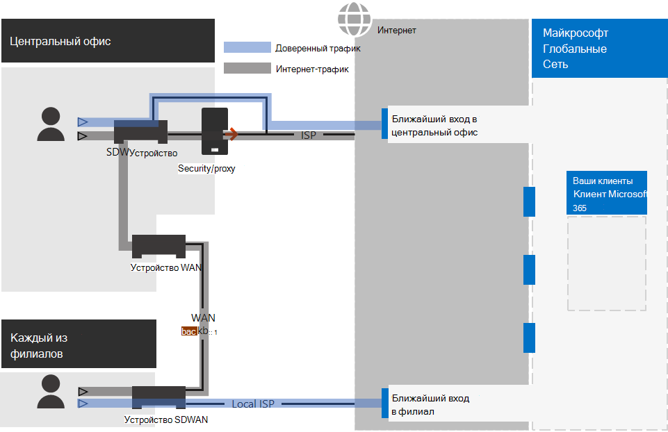

# Шаг 2. Оптимальная сеть для Microsoft 365 для корпоративных клиентов

Microsoft 365 для предприятия включает приложения облачной производительности, такие как Teams и Exchange Online и Microsoft Intune, а также множество служб удостоверений и безопасности Microsoft Azure. Все эти облачные службы зависят от безопасности, производительности и надежности подключений с клиентских устройств в локальной сети или в любом расположении в Интернете. 

Чтобы оптимизировать доступ к сети для клиента, необходимо:

- Оптимизация пути между локальной сетью пользователей и ближайшим расположением к глобальной сети Майкрософт.
- Оптимизация доступа к глобальной сети Майкрософт для удаленных пользователей, использующих VPN-решение удаленного доступа.
- Используйте Network Insights для разработки периметра сети для расположения офисов.
- Оптимизация доступа к определенным активам, SharePoint сайтам с помощью Office 365 CDN.
- Настройка прокси-серверов и сетевых устройств для обхода обработки для Microsoft 365 трафика со списком конечных точек и автоматизация обновления списка по мере внесения изменений.

## Enterprise рабочих на месте

Для корпоративных сетей необходимо оптимизировать работу конечного пользователя, включив самый высокий доступ к сети между клиентами и ближайшими Microsoft 365 конечными точками. Качество работы конечного пользователя напрямую связано с производительностью и оперативностью приложения, которое использует пользователь. Например, Microsoft Teams с низкой задержкой, чтобы телефонные звонки, конференции и совместная работа с общим экраном были без сбоев.

Основная цель в проектировании сети должна быть в том, чтобы свести к минимуму задержку, снизив время в пути (RTT) с клиентских устройств до глобальной сети Microsoft, связующих все центры обработки данных Майкрософт с низкой задержкой и высокой доступностью точек входа облачных приложений, известных как входные двери, распространяющихся по всему миру.

Вот пример традиционной корпоративной сети.

На этом рисунке филиалы подключаются к центральному офису с помощью устройств широкой сети (WAN) и магистрали WAN. Доступ в Интернет через устройство безопасности или прокси-сервер на краю сети центрального офиса и поставщика интернет-услуг (ISP). В Интернете Глобальная сеть Майкрософт имеет ряд входных дверей в регионах по всему миру. Организации также могут использовать промежуточные расположения для дополнительной обработки пакетов и обеспечения безопасности для трафика. Клиент Microsoft 365 организации находится в глобальной сети Майкрософт.

Проблемы с этой конфигурацией для Microsoft 365 облачных служб:

- Для пользователей в филиалах трафик отправляется в не локальные входные двери, что увеличивает задержку.
- Отправка трафика в промежуточные расположения создает сетевые шпильки, которые выполняют дубликат обработки пакетов в надежном трафике, что увеличивает задержку.
- Сетевые устройства edge выполняют необязвимую и дубликатную обработку пакетов в надежном трафике, что увеличивает задержку.

Оптимизация Microsoft 365 производительности сети не должна быть сложной. Вы можете получить максимально возможную производительность, следуя нескольким ключевым принципам:

- Определите Microsoft 365 сетевого трафика, который является доверенным трафиком, предназначенным для облачных служб Майкрософт.
- Разрешить локальным филиалам Microsoft 365 сетевого трафика в Интернет из каждого расположения, в котором пользователи подключаются к Microsoft 365.
- Избегайте сетевых шпильки.
- Разрешить Microsoft 365 для обхода прокси и устройств проверки пакетов.

При реализации этих принципов корпоративная сеть оптимизирована для Microsoft 365.

На этой иллюстрации филиалы имеют собственное подключение к Интернету с помощью устройства WAN(SDWAN), определяемого программным обеспечением, которое отправляет надежный трафик Microsoft 365 в ближайшую к региону входную дверь. В центральном офисе доверенные Microsoft 365 трафика обходят устройства безопасности или прокси, а промежуточные устройства больше не используются.

Вот как оптимизированная конфигурация решает проблемы задержки традиционной корпоративной сети:

- Надежный Microsoft 365 трафик пропускает магистрали WAN и отправляется в локальные входные двери для всех офисов, уменьшая задержку.
- Сетевые шпильки, которые выполняют дубликатную обработку пакетов, пропускаются для Microsoft 365 трафика, уменьшая задержку.
- Сетевые устройства, которые выполняют необязвимую и дублирующую обработку пакетов, пропускаются для Microsoft 365 трафика, уменьшая задержку.

Дополнительные сведения см. [в Microsoft 365 обзор сетевого подключения.](../enterprise/microsoft-365-networking-overview.md)

## Удаленные сотрудники

Если удаленные сотрудники используют традиционный VPN-клиент для получения удаленного доступа к сети организации, убедитесь, что для VPN-клиента поддерживается раздельное туннелирование. Без раздельного туннелирования весь трафик для удаленной работы направляется через VPN-подключение, откуда перенаправляется на пограничные устройства организации, обрабатывается, а затем отправляется в Интернет. Пример:

В этой иллюстрации Microsoft 365 трафик должен проходить косвенный маршрут через организацию, который можно было бы перенапрядить в входную дверь Microsoft Global Network далеко от физического расположения VPN-клиента. Использование непрямого пути приводит к задержке сетевого трафика и снижению общей производительности. 

При использовании раздельного туннелирования в настройках VPN-клиента можно исключить передачу определенных типов трафика через VPN-подключение в сеть организации.

Чтобы оптимизировать доступ к облачным ресурсам Microsoft 365, в настройках VPN-клиентов с раздельным туннелированием исключите трафик через VPN-подключение к конечным точкам Microsoft 365 категории **оптимизации**. Дополнительные сведения см. [в Office 365 категориях](../enterprise/microsoft-365-network-connectivity-principles.md#new-office-365-endpoint-categories) конечных точек и списках конечных точек оптимизируемой категории для раздельного туннелинга. 

Ниже приводится поток трафика для раздельного туннелирования, в котором большая часть трафика Microsoft 365 облачных приложений обходит VPN-подключение.

На этой иллюстрации клиент VPN отправляет и получает важные Microsoft 365 трафика облачных служб непосредственно через Интернет и в ближайшую входную дверь в Глобальную сеть Майкрософт.

Дополнительные сведения и инструкции см. в статье [Оптимизация подключения Office 365 для удаленных пользователей с помощью раздельного VPN-туннелирования](../enterprise/microsoft-365-vpn-split-tunnel.md).

## Использование сетевых инсайтов (предварительный просмотр)

Анализ сетевых данных — это показатели производительности, собранные Microsoft 365 клиента, которые помогают вам разработать периметры сети для расположения офисов. Каждое представление содержит подробные сведения о характеристиках производительности для указанной проблемы для каждого географического расположения, в котором пользователи локального доступа к вашему клиенту.

Существует два сетевых анализа уровня клиента, которые могут быть показаны для клиента:

- [Exchange подключений, на которые влияют проблемы с подключением](../enterprise/office-365-network-mac-perf-insights.md#exchange-sampled-connections-impacted-by-connectivity-issues)
- [SharePoint подключений, на которые влияют проблемы с подключением](../enterprise/office-365-network-mac-perf-insights.md#sharepoint-sampled-connections-impacted-by-connectivity-issues)

Это конкретные сетевые сведения для каждого расположения офиса:

- [Откат сетевой регрессии](../enterprise/office-365-network-mac-perf-insights.md#backhauled-network-egress)
- [Улучшение производительности, обнаруженное для клиентов, близких к вам](../enterprise/office-365-network-mac-perf-insights.md#better-performance-detected-for-customers-near-you)
- [Использование не оптимальной Exchange Online входной двери службы](../enterprise/office-365-network-mac-perf-insights.md#use-of-a-non-optimal-exchange-online-service-front-door)
- [Использование не оптимальной входной двери SharePoint online-службы](../enterprise/office-365-network-mac-perf-insights.md#use-of-a-non-optimal-sharepoint-online-service-front-door)
- [Низкая скорость загрузки SharePoint входной двери](../enterprise/office-365-network-mac-perf-insights.md#low-download-speed-from-sharepoint-front-door)
- [Оптимальное сетевое отступление пользователей Китая](../enterprise/office-365-network-mac-perf-insights.md#china-user-optimal-network-egress)

>[!IMPORTANT]
>Сведения о сети, рекомендации по производительности и оценки в центре администрирования Microsoft 365 в настоящее время находятся в состоянии предварительного просмотра. Он доступен только для Microsoft 365, которые были зарегистрированы в программе предварительного просмотра функций.

Дополнительные сведения см. [в Microsoft 365 Network Insights.](../enterprise/office-365-network-mac-perf-insights.md)

## SharePoint с Office 365 CDN

Облачный сеть доставки содержимого (CDN) позволяет сократить время нагрузки, сохранить пропускную способность и скорость реагирования. A CDN производительность путем кэшинга статических активов, таких как графические или видеофайлы ближе к запрашивающих их браузеров, что помогает ускорить загрузки и уменьшить задержки. Встроенные Office 365 сеть доставки содержимого (CDN), включенные SharePoint в Microsoft 365 E3 и E5, можно использовать для статических активов, чтобы обеспечить лучшую производительность SharePoint страниц.

Сети доставки содержимого Office 365 состоит из нескольких сетей CDN, позволяющих размещать статические ресурсы в нескольких расположениях или _источниках_ и использовать их из глобальных высокоскоростных сетей. В зависимости от типа контента, который вы хотите использовать в  Office 365 CDN,  можно добавить общедоступные и частные истоки или оба.

При развертывании и настройке Office 365 CDN загружает ресурсы из государственного и частного происхождения и делает их доступными для быстрого доступа к пользователям, расположенным через Интернет.

Дополнительные сведения см. в [Office 365 CDN с SharePoint Online.](../enterprise/use-microsoft-365-cdn-with-spo.md)

## Автоматическое перечисление конечной точки

Чтобы локально клиенты, edge devices и облачные службы анализа пакетов пропускали обработку доверенных Microsoft 365 трафика, необходимо настроить их с набором конечных точек (диапазоны IP-адресов и имена DNS), соответствующими Microsoft 365 службам. Эти конечные точки можно настраивать вручную в брандмауэрах и других устройствах безопасности края, файлах PAC для клиентских компьютеров для обхода прокси-компьютеров или устройствах SD-WAN в филиалах. Однако конечные точки изменяются со временем, что требует постоянного ручного обслуживания списков конечных точек в этих расположениях.

Чтобы автоматизировать управление перечислением и изменением для конечных точек Microsoft 365 клиентских PAC-файлов и сетевых устройств, используйте Office 365 [IP-адрес и URL-адрес веб-службы](../enterprise/microsoft-365-ip-web-service.md)REST. Эта служба позволяет лучше определять и Microsoft 365 сетевой трафик, упрощая оценку, настройку и обновление последних изменений.

Вы можете использовать PowerShell, Python или другие языки для определения изменений конечных точек с течением времени и настройки файлов PAC и устройств edge network.

Основной процесс:

1. Используйте веб Office 365 IP-адрес и URL-адрес, а также механизм конфигурации по вашему выбору, чтобы настроить файлы PAC и сетевые устройства с текущим набором Microsoft 365 конечных точек.
2. Запустите ежедневный повтор, чтобы проверить изменения конечных точек или использовать метод уведомления.
3. При обнаружении изменений регенерировать и перераспределить файл PAC для клиентских компьютеров и внести изменения в сетевые устройства.

Дополнительные сведения см. [в Office 365 IP-адресе и веб-службе URL-адреса.](../enterprise/microsoft-365-ip-web-service.md)

## Результаты этапа 2

Для Microsoft 365 клиента с оптимальной сетью вы определили:

- Оптимизация производительности сети для локального пользователя путем добавления подключений к Интернету во все филиалы и устранения сетевых защелок.
- Внедрение автоматизированного списка доверенных конечных точек для клиентских файлов PAC и сетевых устройств и служб, включая текущие обновления (наиболее подходящие для корпоративных сетей).
- Поддержка доступа удаленных сотрудников к локальному ресурсу.
- Использование сетевых инсайтов
- Развертывание Office 365 CDN.

Вот пример организации предприятия и ее клиента с оптимальной сетью.

[См. более крупную версию этого изображения](https://github.com/MicrosoftDocs/microsoft-365-docs/raw/public/microsoft-365/media/tenant-management-overview/tenant-management-tenant-build-step2.png)

На этой иллюстрации клиент этой организации имеет:

- Локальный доступ в Интернет для каждого филиала с устройством SDWAN, которое передает Microsoft 365 трафик в местную входную дверь.
- Нет сетевых шпильки.
- Центральные устройства безопасности и прокси-серверы, Microsoft 365 надежный трафик в локальная входная дверь.

## Текущее обслуживание для оптимального сетевого обслуживания

На постоянной основе может потребоваться:

- Обновите свои устройства и развернутые файлы PAC для изменения конечных точек или убедитесь, что автоматизированный процесс работает правильно.
- Управление активами в Office 365 CDN.
- Обновление конфигурации раздельного туннеля в VPN-клиентах для изменения конечных точек.

## Следующий этап

Продолжайте [работу с удостоверениями,](tenant-management-identity.md) чтобы синхронизировать свои учетные записи и группы и обеспечить безопасность входов пользователей.
