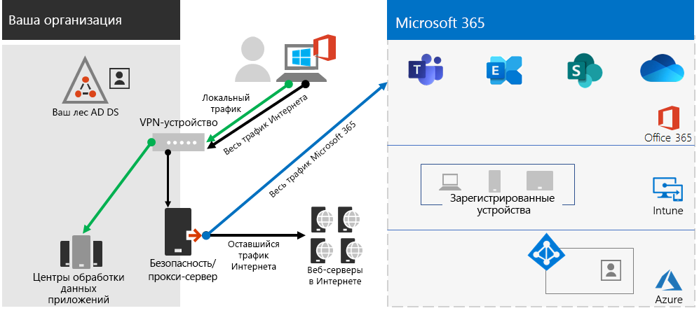

# Шаг 2.Step 2. Оптимальная сеть для microsoft 365 для корпоративных клиентовOptimal networking for your Microsoft 365 for enterprise tenants

Microsoft 365 для предприятия включает приложения облачной производительности, такие как Teams и Exchange Online и Microsoft Intune, а также множество служб удостоверений и безопасности Microsoft Azure.Microsoft 365 for enterprise includes cloud productivity apps such as Teams and Exchange Online, and Microsoft Intune, along with many identity and security services of Microsoft Azure. Все эти облачные службы зависят от безопасности, производительности и надежности подключений с клиентских устройств в локальной сети или в любом расположении в Интернете.All of these cloud-based services rely on the security, performance, and reliability of connections from client devices on your on-premises network or any location on the Internet. 

Чтобы оптимизировать доступ к сети для клиента, необходимо:To optimize network access for your tenant, you need to:

- Оптимизация пути между локальной сетью пользователей и ближайшим расположением к глобальной сети Майкрософт.Optimize the path between your on-premises users and the closest location to the Microsoft Global Network.
- Оптимизация доступа к глобальной сети Майкрософт для удаленных пользователей, использующих VPN-решение удаленного доступа.Optimize access to the Microsoft Global Network for your remote users that are using a remote access VPN solution.
- Используйте Network Insights для разработки периметра сети для расположения офисов.Use Network Insights to design the network perimeter for your office locations.
- Оптимизация доступа к определенным активам, которые будут доступны на сайтах SharePoint с помощью CDN Office 365.Optimize access to specific assets hosted on SharePoint sites with the Office 365 CDN.
- Настройка прокси-серверов и сетевых устройств для обхода обработки для доверенного трафика Microsoft 365 со списком конечных точек и автоматизация обновления списка по мере внесения изменений.Configure proxy and network edge devices to bypass processing for Microsoft 365 trusted traffic with the list of endpoints and automate the updating of the list as changes are made.

## Корпоративные работникиEnterprise on-premises workers

Для корпоративных сетей необходимо оптимизировать работу конечного пользователя, включив самый высокий доступ к сети между клиентами и ближайшими конечными точками Microsoft 365.For enterprise networks, you should optimize the end user experience by enabling the highest-performing network access between clients and the closest Microsoft 365 endpoints. Качество работы конечного пользователя напрямую связано с производительностью и оперативностью приложения, которое использует пользователь.The quality of end user experience is directly related to the performance and responsiveness of the application that the user is using. Например, Microsoft Teams полагается на низкую задержку, чтобы телефонные звонки, конференции и совместная работа с общим экраном были без сбоев.For example, Microsoft Teams relies on low latency so that user phone calls, conferences and shared screen collaborations are glitch-free.

Основная цель в проектировании сети должна быть в том, чтобы свести к минимуму задержку, снизив время в пути (RTT) с клиентских устройств до глобальной сети Microsoft, связующих все центры обработки данных Майкрософт с низкой задержкой и высокой доступностью точек входа облачных приложений, известных как входные двери, распространяющихся по всему миру.The primary goal in the network design should be to minimize latency by reducing the round-trip time (RTT) from client devices to the Microsoft Global Network, Microsoft's public network backbone that interconnects all of Microsoft's datacenters with low latency, high availability cloud application entry points, known as front doors, spread around the world.

Вот пример традиционной корпоративной сети.Here is an example of a traditional enterprise network.

На этом рисунке филиалы подключаются к центральному офису с помощью устройств широкой сети (WAN) и магистрали WAN.In this illustration, branch offices connect to a central office through wide area network (WAN) devices and a WAN backbone. Доступ в Интернет через устройство безопасности или прокси-сервер на краю сети центрального офиса и поставщика интернет-услуг (ISP).Internet access is through a security or proxy device at the network edge of the central office and an Internet service provider (ISP). В Интернете Глобальная сеть Майкрософт имеет ряд входных дверей в регионах по всему миру.On the Internet, the Microsoft Global Network has a series of front doors in regions around the world. Организации также могут использовать промежуточные расположения для дополнительной обработки пакетов и обеспечения безопасности для трафика.Organizations can also use intermediate locations for additional packet processing and security for traffic. Клиент Microsoft 365 организации находится в глобальной сети Майкрософт.An organization's Microsoft 365 tenant is located within the Microsoft Global Network.

Проблемы с этой конфигурацией для облачных служб Microsoft 365:The problems with this configuration for Microsoft 365 cloud services are:

- Для пользователей в филиалах трафик отправляется в не локальные входные двери, что увеличивает задержку.For users in branch offices, traffic gets sent to non-local front doors, increasing latency.
- Отправка трафика в промежуточные расположения создает сетевые шпильки, которые выполняют дубликат обработки пакетов в надежном трафике, что увеличивает задержку.Sending traffic to intermediate locations create network hairpins that perform duplicate packet processing on trusted traffic, increasing latency.
- Сетевые устройства edge выполняют необязвимую и дубликатную обработку пакетов в надежном трафике, что увеличивает задержку.Network edge devices perform unneeded and duplicate packet processing on trusted traffic, increasing latency.

Оптимизация производительности сети Microsoft 365 не должна быть сложной.Optimizing Microsoft 365 network performance doesn't need to be complicated. Вы можете получить максимально возможную производительность, следуя нескольким ключевым принципам:You can get the best possible performance by following a few key principles:

- Определите сетевой трафик Microsoft 365, который является доверенным трафиком, предназначенным для облачных служб Майкрософт.Identify Microsoft 365 network traffic, which is trusted traffic destined to Microsoft cloud services.
- Разрешить локальный отступ от сетевого трафика Microsoft 365 в Интернет из каждого расположения, где пользователи подключаются к Microsoft 365.Allow local branch egress of Microsoft 365 network traffic to the internet from each location where users connect to Microsoft 365.
- Избегайте сетевых шпильки.Avoid network hairpins.
- Разрешить трафик Microsoft 365 для обхода прокси и устройств проверки пакетов.Allow Microsoft 365 traffic to bypass proxies and packet inspection devices.

При реализации этих принципов корпоративная сеть оптимизирована для Microsoft 365.If you implement these principles, you get an enterprise network optimized for Microsoft 365.

На этой иллюстрации филиалы имеют собственное подключение к Интернету с помощью устройства WAN(SDWAN), определяемого программным обеспечением, которое отправляет надежный трафик Microsoft 365 в ближайшую к региону входную дверь.In this illustration, branch offices have their own Internet connection through a software-defined WAN device (SDWAN) device, which sends trusted Microsoft 365 traffic to the regionally closest front door. В центральном офисе надежный трафик Microsoft 365 обходит устройства безопасности или прокси-серверы, а промежуточные устройства больше не используются.At the central office, trusted Microsoft 365 traffic bypasses the security or proxy device and intermediate devices are no longer used.

Вот как оптимизированная конфигурация решает проблемы задержки традиционной корпоративной сети:Here's are how the optimized configuration solves the latency issues of a traditional enterprise network:

- Надежный трафик Microsoft 365 пропускает магистрали WAN и отправляется в локальные входные двери для всех офисов, уменьшая задержку.Trusted Microsoft 365 traffic skips the WAN backbone and is sent to local front doors for all offices, decreasing latency.
- Сетевые шпильки, которые выполняют дубликат обработки пакетов, пропускаются для доверенного трафика Microsoft 365, что снижает задержку.Network hairpins that perform duplicate packet processing are skipped for Microsoft 365 trusted traffic, decreasing latency.
- Сетевые устройства, которые выполняют необязвимую и дублирующую обработку пакетов, пропускаются для доверенного трафика Microsoft 365, что снижает задержку.Network edge devices that perform unneeded and duplicate packet processing are skipped for Microsoft 365 trusted traffic, decreasing latency.

Дополнительные сведения см. в обзоре подключения к сети [Microsoft 365.](../enterprise/microsoft-365-networking-overview.md)For more information, see [Microsoft 365 network connectivity overview](../enterprise/microsoft-365-networking-overview.md).

## Удаленные сотрудникиRemote workers

Если удаленные сотрудники используют традиционный VPN-клиент для получения удаленного доступа к сети организации, убедитесь, что для VPN-клиента поддерживается раздельное туннелирование.If your remote workers are using a traditional VPN client to obtain remote access to your organization network, verify that the VPN client has split tunneling support. Без раздельного туннелирования весь трафик для удаленной работы направляется через VPN-подключение, откуда перенаправляется на пограничные устройства организации, обрабатывается, а затем отправляется в Интернет.Without split tunneling, all of your remote work traffic gets sent across the VPN connection, where it must be forwarded to your organization’s edge devices, get processed, and then sent on the Internet. Пример:Here is an example.

На этой иллюстрации трафик Microsoft 365 должен проходить косвенный маршрут через организацию, который можно было бы перенапрядить в входную дверь Microsoft Global Network, расположенную далеко от физического расположения клиента VPN.In this illustration, Microsoft 365 traffic must take an indirect route through your organization, which could be forwarded to a Microsoft Global Network front door far away from the VPN client’s physical location. Использование непрямого пути приводит к задержке сетевого трафика и снижению общей производительности.This indirect path adds latency to the network traffic and decreases overall performance. 

При использовании раздельного туннелирования в настройках VPN-клиента можно исключить передачу определенных типов трафика через VPN-подключение в сеть организации.With split tunneling, you can configure your VPN client to exclude specific types of traffic from being sent over the VPN connection to the organization network.

Чтобы оптимизировать доступ к облачным ресурсам Microsoft 365, в настройках VPN-клиентов с раздельным туннелированием исключите трафик через VPN-подключение к конечным точкам Microsoft 365 категории **оптимизации**.To optimize access to Microsoft 365 cloud resources, configure your split tunneling VPN clients to exclude traffic to the **Optimize** category Microsoft 365 endpoints over the VPN connection. Дополнительные сведения см. в разделе Конечной  точки [Office 365](../enterprise/microsoft-365-network-connectivity-principles.md#new-office-365-endpoint-categories) и списках конечных точек оптимизируемой категории для раздельного туннелинга.For more information, see [Office 365 endpoint categories](../enterprise/microsoft-365-network-connectivity-principles.md#new-office-365-endpoint-categories) and [the lists](../enterprise/microsoft-365-vpn-implement-split-tunnel.md#implement-vpn-split-tunneling) of Optimize category endpoints for split tunneling.

Ниже приводится поток трафика для раздельного туннелирования, в котором большая часть трафика в облачные приложения Microsoft 365 обходит VPN-подключение.Here is the resulting traffic flow for split tunneling, in which most of the traffic to Microsoft 365 cloud apps bypass the VPN connection.

На этой иллюстрации клиент VPN отправляет и получает важнейший трафик облачной службы Microsoft 365 непосредственно через Интернет и в ближайшую входную дверь в Глобальную сеть Майкрософт.In this illustration, the VPN client sends and receives crucial Microsoft 365 cloud service traffic directly over the Internet and to the nearest front door into the Microsoft Global Network.

Дополнительные сведения и инструкции см. в статье [Оптимизация подключения Office 365 для удаленных пользователей с помощью раздельного VPN-туннелирования](../enterprise/microsoft-365-vpn-split-tunnel.md).For more information and guidance, see [Optimize Office 365 connectivity for remote users using VPN split tunneling](../enterprise/microsoft-365-vpn-split-tunnel.md).

## Использование сетевых инсайтов (предварительный просмотр)Using Network Insights (preview)

Сведения о сети — это показатели производительности, собранные из клиента Microsoft 365, которые помогают вам разработать периметры сети для расположения офисов.Network insights are performance metrics collected from your Microsoft 365 tenant that help you design network perimeters for your office locations. Каждое представление содержит подробные сведения о характеристиках производительности для указанной проблемы для каждого географического расположения, в котором пользователи локального доступа к вашему клиенту.Each insight provides live details about the performance characteristics for a specified issue for each geographic location where on-premises users are accessing your tenant.

Существует два сетевых анализа уровня клиента, которые могут быть показаны для клиента:There are two tenant level network insights that may be shown for the tenant:

- [Примеры подключений Exchange, на которые влияют проблемы с подключениемExchange sampled connections impacted by connectivity issues](../enterprise/office-365-network-mac-perf-insights.md#exchange-sampled-connections-impacted-by-connectivity-issues)
- [Примеры подключений SharePoint, на которые влияют проблемы с подключениемSharePoint sampled connections impacted by connectivity issues](../enterprise/office-365-network-mac-perf-insights.md#sharepoint-sampled-connections-impacted-by-connectivity-issues)

Это конкретные сетевые сведения для каждого расположения офиса:These are the specific network insights for each office location:

- [Откат сетевой регрессииBackhauled network egress](../enterprise/office-365-network-mac-perf-insights.md#backhauled-network-egress)
- [Улучшение производительности, обнаруженное для клиентов, близких к вамBetter performance detected for customers near you](../enterprise/office-365-network-mac-perf-insights.md#better-performance-detected-for-customers-near-you)
- [Использование входной двери не оптимальной службы Exchange OnlineUse of a non-optimal Exchange Online service front door](../enterprise/office-365-network-mac-perf-insights.md#use-of-a-non-optimal-exchange-online-service-front-door)
- [Использование входной двери не оптимальной службы SharePoint OnlineUse of a non-optimal SharePoint Online service front door](../enterprise/office-365-network-mac-perf-insights.md#use-of-a-non-optimal-sharepoint-online-service-front-door)
- [Низкая скорость загрузки с передней двери SharePointLow download speed from SharePoint front door](../enterprise/office-365-network-mac-perf-insights.md#low-download-speed-from-sharepoint-front-door)
- [Оптимальное сетевое отступление пользователей КитаяChina user optimal network egress](../enterprise/office-365-network-mac-perf-insights.md#china-user-optimal-network-egress)

>[!IMPORTANT]
>Анализ сетевых данных, рекомендации по производительности и оценки в Центре администрирования Microsoft 365 в настоящее время находятся в состоянии предварительного просмотра.Network insights, performance recommendations and assessments in the Microsoft 365 Admin Center is currently in preview status. Он доступен только для клиентов Microsoft 365, которые были зарегистрированы в программе предварительного просмотра функций.It is only available for Microsoft 365 tenants that have been enrolled in the feature preview program.

Дополнительные сведения см. [в веб-сайте Microsoft 365 Network Insights.](../enterprise/office-365-network-mac-perf-insights.md)For more information, see [Microsoft 365 Network Insights](../enterprise/office-365-network-mac-perf-insights.md).

## Производительность SharePoint с CDN Office 365SharePoint performance with the Office 365 CDN

Облачная сеть доставки контента (CDN) позволяет сократить время нагрузки, сохранить пропускную способность и скорость реагирования.A cloud-based Content Delivery Network (CDN) allows you to reduce load times, save bandwidth, and speed responsiveness. CdN повышает производительность путем кэшинга статических активов, таких как графические или видеофайлы, ближе к запрашивающих их браузерам, что помогает ускорить загрузки и снизить задержку.A CDN improves performance by caching static assets such as graphic or video files closer to the browsers requesting them, which helps to speed up downloads and reduce latency. Встроенная сеть доставки контента Office 365, включенная в SharePoint в Microsoft 365 E3 и E5, может использовать встроенную сеть доставки контента Office 365, чтобы обеспечить лучшую производительность страниц SharePoint.You can use the built-in Office 365 Content Delivery Network (CDN), included with SharePoint in Microsoft 365 E3 and E5, to host static assets to provide better performance for your SharePoint pages.

Сети доставки содержимого Office 365 состоит из нескольких сетей CDN, позволяющих размещать статические ресурсы в нескольких расположениях или _источниках_ и использовать их из глобальных высокоскоростных сетей.The Office 365 CDN is composed of multiple CDNs that allow you to host static assets in multiple locations, or _origins_, and serve them from global high-speed networks. В зависимости от типа контента, который вы хотите использовать в CDN  Office 365, можно добавить общедоступные и частные истоки или оба. Depending on the kind of content you want to host in the Office 365 CDN, you can add **public** origins, **private** origins, or both.

При развертывании и настройке CDN Office 365 загружает ресурсы из государственного и частного происхождения и делает их доступными для быстрого доступа к пользователям, расположенным через Интернет.When deployed and configured, the Office 365 CDN uploads assets from public and private origins and makes them available for fast access to users located across the Internet.

Дополнительные сведения см. в [раздел Использование CDN Office 365 с SharePoint Online.](../enterprise/use-microsoft-365-cdn-with-spo.md)For more information, see [Use the Office 365 CDN with SharePoint Online](../enterprise/use-microsoft-365-cdn-with-spo.md).

## Автоматическое перечисление конечной точкиAutomated endpoint listing

Чтобы локально клиенты, устройства и облачные службы анализа пакетов пропускали обработку доверенного трафика Microsoft 365, необходимо настроить их с набором конечных точек (диапазоны IP-адресов и имена DNS), соответствующим службам Microsoft 365.To have your on-premises clients, edge devices, and cloud-based packet analysis services skip processing of trusted Microsoft 365 traffic, you must configure them with the set of endpoints (IP address ranges and DNS names) corresponding to Microsoft 365 services. Эти конечные точки можно настраивать вручную в брандмауэрах и других устройствах безопасности края, файлах PAC для клиентских компьютеров для обхода прокси-компьютеров или устройствах SD-WAN в филиалах.These endpoints can be manually configured in firewalls and other edge security devices, PAC files for client computers to bypass proxies, or SD-WAN devices at branch offices. Однако конечные точки изменяются со временем, что требует постоянного ручного обслуживания списков конечных точек в этих расположениях.However, the endpoints change over time, requiring ongoing manual maintenance of the endpoint lists in these locations.

Чтобы автоматизировать управление перечислением и изменением конечных точек Microsoft 365 в клиентских файлах PAC и сетевых устройствах, используйте [IP-адрес Office 365](../enterprise/microsoft-365-ip-web-service.md)и веб-службу REST НА ОСНОВЕ URL-адресов.To automate the listing and change management for Microsoft 365 endpoints in your client PAC files and network devices, use the [Office 365 IP Address and URL REST-based web service](../enterprise/microsoft-365-ip-web-service.md). Эта служба позволяет лучше определять и различать сетевой трафик Microsoft 365, упрощая оценку, настройку и обновление последних изменений.This service helps you better identify and differentiate Microsoft 365 network traffic, making it easier for you to evaluate, configure, and stay current with the latest changes.

Вы можете использовать PowerShell, Python или другие языки для определения изменений конечных точек с течением времени и настройки файлов PAC и устройств edge network.You can use PowerShell, Python, or other languages to determine the changes to endpoints over time and configure your PAC files and edge network devices.

Основной процесс:The basic process is:

1. Используйте IP-адрес и URL-службу Office 365, а также механизм конфигурации по вашему выбору, чтобы настроить файлы PAC и сетевые устройства с текущим набором конечных точек Microsoft 365.Use the Office 365 IP Address and URL web service and the configuration mechanism of your choice to configure your PAC files and network devices with the current set of Microsoft 365 endpoints.
2. Запустите ежедневный повтор, чтобы проверить изменения конечных точек или использовать метод уведомления.Run a daily recurring to check for changes in the endpoints or use a notification method.
3. При обнаружении изменений регенерировать и перераспределить файл PAC для клиентских компьютеров и внести изменения в сетевые устройства.When changes are detected, regenerate and redistribute the PAC file for client computers and make the changes to your network devices.

Дополнительные сведения см. в [веб-службе IP-адреса и URL-адреса Office 365.](../enterprise/microsoft-365-ip-web-service.md)For more information, see [Office 365 IP Address and URL web service](../enterprise/microsoft-365-ip-web-service.md).

## Результаты этапа 2Results of Step 2

Для клиента Microsoft 365 с оптимальной сетью вы определили:For your Microsoft 365 tenant with optimal networking, you have determined:

- Оптимизация производительности сети для локального пользователя путем добавления подключений к Интернету во все филиалы и устранения сетевых защелок.How to optimize network performance for on-premises users by adding Internet connections to all branch offices and eliminating network hairpins.
- Внедрение автоматизированного списка доверенных конечных точек для клиентских файлов PAC и сетевых устройств и служб, включая текущие обновления (наиболее подходящие для корпоративных сетей).How to implement automated trusted endpoint listing for your client-based PAC files and your network devices and services, including ongoing updates (most suitable for enterprise networks).
- Поддержка доступа удаленных сотрудников к локальному ресурсу.How to support the access of remote workers to on-premises resources.
- Использование сетевых инсайтовHow to use Network Insights
- Развертывание CDN Office 365.How to deploy the Office 365 CDN.

Вот пример организации предприятия и ее клиента с оптимальной сетью.Here is an example of an enterprise organization and its tenant with optimal networking.

[См. более крупную версию этого изображенияSee a larger version of this image](https://github.com/MicrosoftDocs/microsoft-365-docs/raw/public/microsoft-365/media/tenant-management-overview/tenant-management-tenant-build-step2.png)

На этой иллюстрации клиент этой организации имеет:In this illustration, the tenant for this enterprise organization has:

- Локальный доступ в Интернет для каждого филиала с устройством SDWAN, которое передает надежный трафик Microsoft 365 в местную входную дверь.Local internet access for each branch office with an SDWAN device that forwards trusted Microsoft 365 traffic to a local front door.
- Нет сетевых шпильки.No network hairpins.
- Центральные устройства безопасности и прокси-серверы, которые перенадвигают надежный трафик Microsoft 365 в локальная входная дверь.Central office security and proxy edge devices that forward Microsoft 365 trusted traffic to a local front door.

## Текущее обслуживание для оптимального сетевого обслуживанияOngoing maintenance for optimal networking

На постоянной основе может потребоваться:On an ongoing basis, you might need to:

- Обновите свои устройства и развернутые файлы PAC для изменения конечных точек или убедитесь, что автоматизированный процесс работает правильно.Update your edge devices and deployed PAC files for changes in endpoints or verify that your automated process works properly.
- Управление активами в CDN Office 365.Manage your assets in the Office 365 CDN.
- Обновление конфигурации раздельного туннеля в VPN-клиентах для изменения конечных точек.Update the split tunneling configuration in your VPN clients for changes in endpoints.

## Следующий этапNext step

Продолжайте [работу с удостоверениями,](tenant-management-identity.md) чтобы синхронизировать свои учетные записи и группы и обеспечить безопасность входов пользователей.Continue with [identity](tenant-management-identity.md) to synchronize your on-premises accounts and groups and enforce secure user sign-ins.
