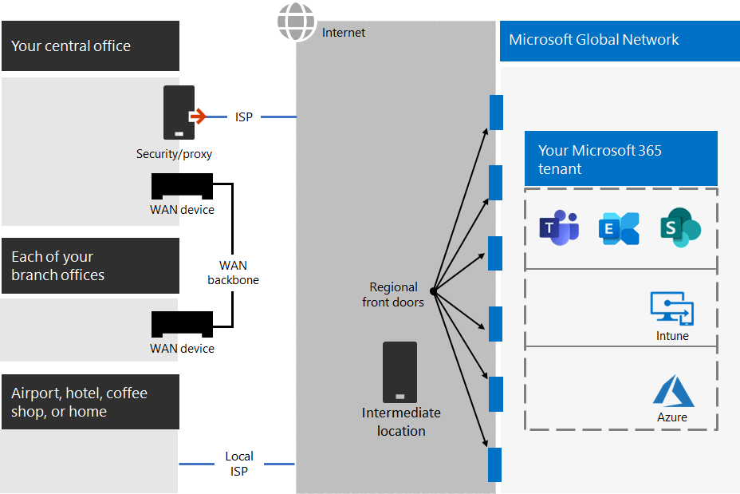

# Шаг 2. Оптимальная сеть для клиентов Microsoft 365 для предприятий

Microsoft 365 для предприятий включает облачные приложения для повышения производительности, такие как Teams и Exchange Online, а также Microsoft Intune, а также множество служб удостоверений и безопасности Microsoft Azure. Все эти облачные службы зависят от безопасности, производительности и надежности подключений с клиентских устройств в локальной сети или в любом расположении в Интернете. 

Чтобы оптимизировать сетевой доступ для клиента, необходимо:

- Оптимизируйте путь между вашими пользователями в локальной сети и ближайшим расположением к глобальной сети Майкрософт.
- Оптимизируйте доступ к глобальной сети Майкрософт для удаленных пользователей, использующих VPN-решение удаленного доступа.
- Используйте Network Insights для разработки периметра сети для местоположений офисов.
- Оптимизируйте доступ к определенным активам, которые можно найти на сайтах SharePoint с помощью сети CDN Office 365.
- Настройте прокси-серверы и сетевые устройства для обхода обработки доверенного трафика Microsoft 365 со списком конечных точек и автоматизировать обновление списка по мере внесения изменений.

## Корпоративные работники локальной организации

Для корпоративных сетей следует оптимизировать работу конечных пользователей, включив самый высокий сетевой доступ между клиентами и ближайшими конечными точками Microsoft 365. Качество работы конечного пользователя напрямую связано с производительностью и скоростью отклика приложения, которое использует пользователь. Например, Microsoft Teams полагается на низкую задержку, чтобы телефонные звонки, конференции и совместная работа с общим экраном были без сбоев.

Основной целью проекта сети должно быть минимизация задержки путем сокращения времени кругового пути (RTT) от клиентских устройств к глобальной сети Майкрософт, магистрали общедоступных сетей Майкрософт, которая пересекает все центр обработки данных Майкрософт с низкой задержкой, точками входа в облако высокой доступности, которые называются входными окнами, по всему миру.

Вот пример традиционной корпоративной сети.

На этом рисунке филиалы подключаются к центральному офису через устройства WAN и магистрали WAN. Доступ к Интернету через устройство безопасности или прокси-сервер на границе сети центрального офиса и поставщика услуг Интернета (ISP). В Интернете глобальная сеть Майкрософт имеет ряд переднего входа в регионах по всему миру. Организации также могут использовать промежуточные расположения для дополнительной обработки пакетов и обеспечения безопасности трафика. Клиент Microsoft 365 организации расположен в глобальной сети Майкрософт.

Проблемы с этой конфигурацией для облачных служб Microsoft 365:

- Для пользователей в филиалах трафик отправляется в не локальные окни переднего входа, что увеличивает задержку.
- При отправке трафика в промежуточные расположения создаются разкрутки сети, которые выполняют повторяющиеся обработки пакетов для доверенного трафика, что увеличивает задержку.
- Сетевые устройства по краям сети выполняют ненудимую и дублирующуюся обработку пакетов для доверенного трафика, увеличивая задержку.

Оптимизация производительности сети Microsoft 365 не должна быть сложной. Вы можете получить максимально возможную производительность, следуя нескольким ключевым принципам:

- Определите сетевой трафик Microsoft 365, который является доверенным трафиком, предназначенным для облачных служб Майкрософт.
- Разрешить локальный ветвь сетевого трафика Microsoft 365 в Интернет из каждого расположения, в котором пользователи подключаются к Microsoft 365.
- Избегайте разкрутки по сети.
- Разрешить трафику Microsoft 365 обходить прокси-устройства и устройства проверки пакетов.

При реализации этих принципов корпоративная сеть оптимизирована для Microsoft 365.

На этом рисунке филиалы имеют собственное подключение к Интернету через программно-определяемую WAN-устройство (SDWAN), которое отправляет доверенный трафик Microsoft 365 на ближайший к региону передний вход. В центральном офисе доверенный трафик Microsoft 365 обходит устройство безопасности или прокси-сервер, а промежуточные устройства больше не используются.

Вот как оптимизированная конфигурация решает проблемы с задержкой в традиционной корпоративной сети:

- Доверенный трафик Microsoft 365 пропускает магистрали WAN и отправляется в локальные окне переднего входа для всех офисов, снижая задержку.
- Разкрутки пакетов сети, которые выполняют повторяющиеся обработки пакетов, пропускаются для доверенного трафика Microsoft 365, что сокращает задержку.
- Сетевые устройства, которые выполняют ненудимую и дублирующуюся обработку пакетов, пропускаются для доверенного трафика Microsoft 365, снижая задержку.

Дополнительные сведения см. в обзоре сетевого подключения [Microsoft 365.](../enterprise/microsoft-365-networking-overview.md)

## Удаленные сотрудники

Если удаленные сотрудники используют традиционный VPN-клиент для получения удаленного доступа к сети организации, убедитесь, что для VPN-клиента поддерживается раздельное туннелирование. Без раздельного туннелирования весь трафик для удаленной работы направляется через VPN-подключение, откуда перенаправляется на пограничные устройства организации, обрабатывается, а затем отправляется в Интернет. Пример:

На этом рисунке трафик Microsoft 365 должен проходить через вашу организацию по непрямому маршруту, который может быть перенаадваем на входную линию глобальной сети Майкрософт, расположенную далеко от физического расположения VPN-клиента. Использование непрямого пути приводит к задержке сетевого трафика и снижению общей производительности. 

При использовании раздельного туннелирования в настройках VPN-клиента можно исключить передачу определенных типов трафика через VPN-подключение в сеть организации.

Чтобы оптимизировать доступ к облачным ресурсам Microsoft 365, в настройках VPN-клиентов с раздельным туннелированием исключите трафик через VPN-подключение к конечным точкам Microsoft 365 категории **оптимизации**. Дополнительные сведения см. в категориях конечных  точек [Office 365](../enterprise/microsoft-365-network-connectivity-principles.md#new-office-365-endpoint-categories) и списках конечных точек категории "Оптимизация" для раздельного туннелинга.

Ниже приводится итоговая потоковая трафик для раздельного туннелирования, в котором большая часть трафика в облачные приложения Microsoft 365 обходит VPN-подключение.

На этом рисунке VPN-клиент отправляет и получает важный трафик облачной службы Microsoft 365 непосредственно через Интернет и в ближайший вход в глобальную сеть Майкрософт.

Дополнительные сведения и инструкции см. в статье [Оптимизация подключения Office 365 для удаленных пользователей с помощью раздельного VPN-туннелирования](../enterprise/microsoft-365-vpn-split-tunnel.md).

## Использование Network Insights (предварительная версия)

Анализ сети — это показатели производительности, собранные клиентом Microsoft 365, которые помогают проектировать периметры сети для офисов. Каждая информация предоставляет подробные сведения о характеристиках производительности для определенной проблемы для каждого географического расположения, в котором пользователи локального расположения имеют доступ к вашему арендатору.

Существует две сетевые статистики на уровне клиента, которые могут быть показаны для клиента:

- [Примеры подключений Exchange, на которые влияют проблемы с подключением](../enterprise/office-365-network-mac-perf-insights.md#exchange-sampled-connections-impacted-by-connectivity-issues)
- [Примеры подключений SharePoint, на которые влияют проблемы с подключением](../enterprise/office-365-network-mac-perf-insights.md#sharepoint-sampled-connections-impacted-by-connectivity-issues)

Вот конкретные сетевые данные для каждого расположения офиса:

- [Откат сетевого экскурса](../enterprise/office-365-network-mac-perf-insights.md#backhauled-network-egress)
- [Более емкие показатели производительности для клиентов, которые рядом с вами](../enterprise/office-365-network-mac-perf-insights.md#better-performance-detected-for-customers-near-you)
- [Использование не оптимальной службы Exchange Online переднего входа](../enterprise/office-365-network-mac-perf-insights.md#use-of-a-non-optimal-exchange-online-service-front-door)
- [Использование не оптимальной входной точки службы SharePoint Online](../enterprise/office-365-network-mac-perf-insights.md#use-of-a-non-optimal-sharepoint-online-service-front-door)
- [Низкая скорость скачивания из переднего входа SharePoint](../enterprise/office-365-network-mac-perf-insights.md#low-download-speed-from-sharepoint-front-door)
- [Оптимальный сетевой эксгрим для пользователей Китая](../enterprise/office-365-network-mac-perf-insights.md#china-user-optimal-network-egress)

>[!IMPORTANT]
>Анализ сети, рекомендации по производительности и оценки в Центре администрирования Microsoft 365 в настоящее время находятся в состоянии предварительной версии. Он доступен только для клиентов Microsoft 365, которые зарегистрированы в программе предварительного просмотра функций.

Дополнительные сведения см. в [microsoft 365 Network Insights.](../enterprise/office-365-network-mac-perf-insights.md)

## Производительность SharePoint с помощью CDN Office 365

Облачная сеть доставки содержимого (CDN) позволяет сократить время загрузки, сократить пропускную способность и скорость отклика. CdN повышает производительность путем кэшинга статических ресурсов, таких как графические или видеофайлы, ближе к браузерам, которые их запрашивают, что позволяет ускорить загрузки и уменьшить задержку. Вы можете использовать встроенную сеть доставки содержимого (CDN) Office 365, включаемую в SharePoint в Microsoft 365 E3 и E5, для статических ресурсов, чтобы обеспечить лучшую производительность страниц SharePoint.

Сети доставки содержимого Office 365 состоит из нескольких сетей CDN, позволяющих размещать статические ресурсы в нескольких расположениях или _источниках_ и использовать их из глобальных высокоскоростных сетей. В зависимости от типа контента, который вы хотите использовать в CDN  Office 365, вы можете добавлять общедоступные и частные источника или и то, и другое. 

При развертывании и настройке сеть CDN Office 365 загружает ресурсы из общедоступных и частных расположений и делает их доступными для быстрого доступа к пользователям, расположенным в Интернете.

Дополнительные сведения см. в сведениях об использовании [сети CDN Office 365 с SharePoint Online.](../enterprise/use-microsoft-365-cdn-with-spo.md)

## Автоматическое описание конечной точки

Чтобы ваши локальное клиенты, edge устройства и облачные службы анализа пакетов пропускали обработку доверенного трафика Microsoft 365, необходимо настроить их с помощью набора конечных точек (диапазонов IP-адресов и DNS-имен), соответствующих службам Microsoft 365. Эти конечные точки можно вручную настроить в брандмауэрах и других устройствах безопасности на границе, файлах PAC для клиентских компьютеров для обхода прокси-компьютеров или устройствах SD-WAN в филиалах. Однако конечные точки со временем изменяются, что требует постоянного ручного обслуживания списков конечных точек в этих расположениях.

Чтобы автоматизировать перечисление и управление изменениями конечных точек Microsoft 365 в клиентских файлах PAC и сетевых устройствах, используйте веб-службу REST на основе [IP-адресов и URL-адресов Office 365.](../enterprise/microsoft-365-ip-web-service.md) Эта служба помогает лучше выявлять и дифференцировать сетевой трафик Microsoft 365, упрощая оценку, настройку и обновление последних изменений.

Вы можете использовать PowerShell, Python или другие языки для определения изменений конечных точек с течением времени и настройки файлов PAC и сетевых устройств.

Базовый процесс:

1. Используйте веб-службу IP-адресов и URL-адресов Office 365, а также механизм настройки файлов PAC и сетевых устройств с текущим набором конечных точек Microsoft 365.
2. Запустите повторяющийся день, чтобы проверить изменения в конечных точках или использовать метод уведомлений.
3. При обнаружении изменений повторно разработать и перераспределить PAC-файл для клиентских компьютеров и внести изменения в сетевые устройства.

Дополнительные сведения см. в веб-службе IP-адресов и [URL-адресов Office 365.](../enterprise/microsoft-365-ip-web-service.md)

## Результаты этапа 2

Для клиента Microsoft 365 с оптимальной сетью вы определили:

- Оптимизация производительности сети для пользователей локальной сети путем добавления подключений к Интернету во все филиалы и устранения разкрутки по сети.
- Как реализовать автоматическое описание доверенного конечной точки для клиентских файлов PAC, сетевых устройств и служб, включая текущие обновления (наиболее подходящие для корпоративных сетей).
- Как поддерживать доступ удаленных сотрудников к локальному ресурсу.
- Использование Network Insights
- Развертывание CDN Office 365.

Вот пример организации и ее клиента с оптимальной сетью.

[См. более крупную версию этого изображения](https://github.com/MicrosoftDocs/microsoft-365-docs/raw/public/microsoft-365/media/tenant-management-overview/tenant-management-tenant-build-step2.png)

На этом рисунке клиент для этой организации имеет:

- Локальный доступ к Интернету для каждого филиала с устройством SDWAN, которое перенаночит доверенный трафик Microsoft 365 на локальный вход.
- Нет разкрутки по сети.
- Устройства безопасности центрального офиса и прокси-серверы, которые перенаг качествеют доверенный трафик Microsoft 365 на локальный сервер переднего входа.

## Текущее обслуживание для оптимального сетевого обслуживания

На постоянной основе может потребоваться:

- Обновите свои устройства и развернутые PAC-файлы для изменения конечных точек или убедитесь, что автоматизированный процесс работает правильно.
- Управление активами в CDN Office 365.
- Обновите конфигурацию раздельного туннелинга в VPN-клиентах для изменения конечных точек.

## Следующий шаг

Продолжайте работу [с удостоверениями,](tenant-management-identity.md) чтобы синхронизировать свои учетные записи и группы в локальной организации и обеспечить безопасный вход пользователей.
