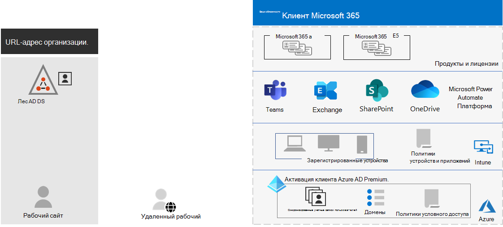
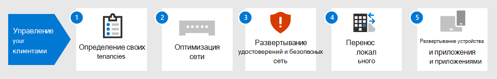

# Управление клиентом для Microsoft 365 для предприятия

Создание пути к цифровой трансформации организации с помощью облачных вычислений требует прочной основы, на которой ваши сотрудники могут полагаться на производительность, совместную работу, производительность, конфиденциальность, соответствие требованиям и безопасность.

Правильная конфигурация клиентов Microsoft 365 обеспечивает этот фундамент, в результате чего ваши сотрудники сосредоточатся на завершении своей работы, а ваш ИТ-отдел сосредоточится на решениях, которые обеспечивают дополнительную бизнес-ценность. 

Это решение принимает вас через конфигурацию этого фундамента в этих шагах:

1. Определение клиентов
2. Оптимизация сети
3. Синхронизация удостоверений и обеспечение безопасности входов
4. Перенос устройств Windows, клиентов Office и локального сервера Office и данных
5. Развертывание управления устройствами и приложениями

Но сначала давайте рассмотрим, что такое клиент и как выглядит клиент, который предоставляет твердую основу.

## Определен клиент Microsoft 365

Клиент Microsoft 365 — это специальный экземпляр служб Microsoft 365 и данных организации, хранимых в определенном расположении по умолчанию, например в Европе или Северной Америке. Это расположение указывается при создании клиента для организации. Каждый клиент Microsoft 365 отличается, уникален и отделен от всех других клиентов Microsoft 365. Вы создаете клиента Microsoft 365 при покупке одного или более продуктов в Microsoft, таких как Microsoft 365 E3 или E5, а также набор лицензий для каждого из них.

Клиент Microsoft 365 также включает клиента Azure Active Directory (Azure AD), который является выделенным экземпляром Azure AD для учетных записей пользователей, групп и других объектов. Каждый клиент Azure AD отличается, уникален и отделен от всех других клиентов Azure AD. Если в организации может быть несколько клиентов Azure AD, которые можно настроить с помощью подписки Azure, то клиенты Microsoft 365 могут использовать только одного клиента Azure AD, созданного при его создания. 

Вот пример:

*Управление клиентом* — это планирование, развертывание и текущая работа клиентов Microsoft 365. 

## Атрибуты хорошо разработанного и операционного клиента

Помимо правильного имени и расположения клиента существуют дополнительные элементы для планирования, развертывания и управления для обеспечения эффективности работы пользователей с облачными приложениями, такими как Microsoft Teams и &mdash; Exchange &mdash; Online.

Вот элементы:

- У вас есть правильный набор продуктов (подписок) и лицензий.
  - Набор продуктов совпадает с потребностями бизнеса, ИТ и безопасности.
  - Существует достаточное количество лицензий для ваших сотрудников и ожидаемые изменения в штате.
- Для сетей:
  - Вы настроили правильные имена доменов DNS.
  - Для корпоративных сетей оптимизирован сетевой трафик в сеть Майкрософт для сотрудников на месте.
  - Оптимизирован сетевой трафик для удаленных сотрудников, использующих VPN-клиент.
- Вы синхронизировали учетные записи, группы и другие объекты.
  - Учетные записи клиента Azure AD соотнесны с почтовыми ящиками Exchange Online с правильными доменами DNS для адресов электронной почты.
  - Учетным записям пользователей назначены правильные лицензии из правильных приобретенных продуктов (например, Microsoft 365 E3 или E5).
- Вы настроили сильное управление удостоверением и доступом.
  - Требуется безопасный вход пользователя с помощью без пароля или многофакторной проверки подлинности (MFA).
  - У вас есть политики условного доступа, которые исполняют требования и ограничения для более высоких уровней безопасности.
- Локально серверы Office и их данные переносились в облачные приложения или используются в гибридной конфигурации.
- Вы занимаетесь управлением устройствами с помощью Intune или Basic Mobility and Security, встроенных в Microsoft 365.
  - Устройства, управляемые организацией, регистрются и управляются.
  - Управляемыми приложениями для личных устройств.

Вот пример клиента Microsoft 365 со всеми этими элементами на месте.

В этой иллюстрации клиент Microsoft 365 включает в себя:

- Продукты и лицензии для Microsoft 365 E3 и E5.
- Приложения для производительности Microsoft 365.
- Intune с зарегистрированными устройствами, политиками устройств и приложений.
- Клиент Azure AD, который синхронизирует учетную запись пользователя (группы и другие объекты каталога не показаны), домены и политики условного доступа.

## Возможности клиента для Microsoft 365 для предприятия

В следующих разделах и таблице перечисляются основные возможности и лицензирование действий в этом решении.

### Tenant

| Возможность или функция | Описание | Лицензирование |
|:-------|:-----|:-------|
| Несколько клиентов | Каждый клиент Microsoft 365 отличается, уникален и отделен от всех других клиентов Microsoft 365. С несколькими арендаторами существуют ограничения и дополнительные соображения при управлении ими и предоставлении услуг пользователям. | Microsoft 365 E3 или E5 | 
| Миграция почтовых ящиков между клиентами | Администраторы-клиенты могут перемещать почтовые ящики между арендаторами с минимальными зависимостями инфраструктуры в локальной системе. Это устраняет необходимость в бортовых и бортовых почтовых ящиках. | Microsoft 365 E3 или E5 | 
| Поддержка нескольких регионов | Клиент может хранить данные в покое в других географических расположениях центра обработки данных, которые вы выбрали для удовлетворения требований оседлости данных. | Microsoft 365 E3 или E5 | 
| Перемещение основных данных в новый геоцентр обработки данных | По мере того как Корпорация Майкрософт добавляет новые геоцентры данных для дополнительных емкостей и вычислительных ресурсов, вы можете запросить перемещение геоцентра данных для резидентства данных в geo для основных данных клиента. | Microsoft 365 E3 или E5 | 
||||

### Сеть

| Возможность или функция | Описание | Лицензирование |
|:-------|:-----|:-------|
| Network Insights | Метрик производительности сети, собранные из клиента Microsoft 365 для разработки периметров сети для расположения офисов. | Microsoft 365 E3 или E5 | 
| Автоматизация обновлений конечной точки | Автоматизировать конфигурацию и текущие обновления конечных точек Microsoft 365 в клиентских файлах PAC, сетевых устройствах и службах. | Microsoft 365 E3 или E5 | 
||||

### Identity

| Возможность или функция | Описание | Лицензирование |
|:-------|:-----|:-------|
| Синхронизация локальной службы домена Active Directory (AD DS) с клиентом Azure AD    | Использование локального поставщика удостоверений для учетных записей пользователей, групп и других объектов. | Microsoft 365 E3 или E5 |
| MFA, внедренная параметрами безопасности, используемыми по умолчанию   | Защита от скомпрометированных удостоверений и устройств путем требования второй формы проверки подлинности для входов. Используемые по умолчанию параметры безопасности требуют MFA для всех учетных записей пользователей.   | Microsoft 365 E3 или E5 |
| MFA, внедренная условным доступом| Требуется MFA на основе атрибутов входной личные данных с политиками условного доступа.    | Microsoft 365 E3 или E5 | 
| MFA, внедренная условным доступом на основе риска   | Требование MFA на основе риска пользовательского входа с помощью Microsoft Defender для удостоверений. | Microsoft 365 E5 или E3 с лицензиями Azure AD Premium P2 | 
| Самостоятельный сброс пароля (SSPR)    | Разрешение пользователям сбрасывать или разблокировать свои пароли и учетные записи.  | Microsoft 365 E3 или E5 |
||||

### Миграция

| Возможность или функция | Описание | Лицензирование |
|:-------|:-----|:-------|
| Переход на Windows 10 | Перенос устройств с Windows 7 или Windows 8.1 на Windows 10 Enterprise. | Лицензии Windows 10 Enterprise, включенные в Microsoft 365 E3 или E5 | 
| Миграция в Microsoft 365 Apps для предприятия | Перенос клиентских приложений Office, таких как Word и PowerPoint, в версии, установленные из облака, которые обновляются с новыми функциями. | Microsoft 365 E3 или E5 | 
| Перенос локального сервера и данных в Microsoft 365 | Перенос почтовых ящиков Exchange, сайтов SharePoint и Skype для бизнеса Online в облачные службы Microsoft 365. | Microsoft 365 E3 или E5 | 
||||

### Управление устройствами и приложениями

| Возможность или функция | Описание | Лицензирование |
|:-------|:-----|:-------|
| Microsoft Intune | Облачная служба, которая предоставляет управление мобильными устройствами (MDM) и управление мобильными приложениями (MAM), чтобы контролировать использование приложений и устройств организации, включая мобильные телефоны, планшеты и ноутбуки. | Microsoft 365 E3 или E5 | 
| Basic Mobility + Security | Защита и управление мобильными устройствами пользователей, например iPhone, iPad, Android и Windows с помощью встроенной службы.  | Microsoft 365 E3 или E5 | 
||||

## Дальнейшие действия

Используйте эти действия, чтобы настроить и управлять клиентами Microsoft 365.

1. [Определение клиентов](tenant-management-tenants.md)
2. [Оптимизация сети](tenant-management-networking.md)
3. [Синхронизация удостоверений и обеспечение безопасности входов](tenant-management-identity.md)
4. [Перенос локального сервера Office и данных](tenant-management-migration.md)
5. [Развертывание управления устройствами и приложениями](tenant-management-device-management.md)

Каждый шаг описывает параметры развертывания, суммирует результаты и текущие задачи по обслуживанию.

Чтобы понять, как вымышленная, но представительная многонациональная организация развернула элементы своего клиента Microsoft 365, см. в примере [Contoso.](../enterprise/contoso-case-study.md)
