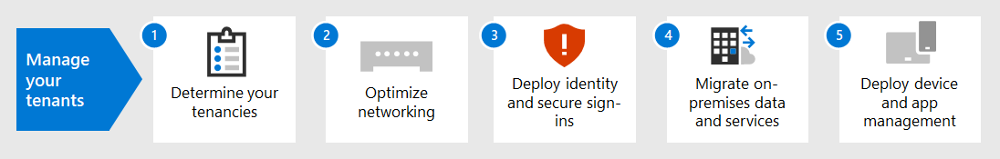

# Управление клиентом для Microsoft 365 для предприятияTenant management for Microsoft 365 for enterprise

Создание пути к цифровой трансформации организации с помощью облачных вычислений требует прочной основы, на которой ваши сотрудники могут полагаться на производительность, совместную работу, производительность, конфиденциальность, соответствие требованиям и безопасность.Creating a path to your organization's digital transformation with cloud computing requires a firm foundation upon which your workers can rely for productivity, collaboration, performance, privacy, compliance, and security.

Правильная конфигурация клиентов Microsoft 365 обеспечивает этот фундамент, в результате чего ваши сотрудники сосредоточатся на завершении своей работы, а ИТ-отдел сосредоточится на решениях, которые обеспечивают дополнительную бизнес-ценность.Correct configuration of your Microsoft 365 tenants provides that foundation, leaving your workers to focus on getting their work done and your IT department to focus on end-to-end solutions that provide additional business value. 

Это решение принимает вас через конфигурацию этого фундамента в этих шагах:This solution takes you through the configuration of that foundation in these steps:

1. Определение клиентовDetermine your tenants
2. Оптимизация сетиOptimize your networking
3. Синхронизация удостоверений и обеспечение безопасности входовSynchronize your identities and enforce secure sign-ins
4. Миграция Windows устройств, Office клиентов и Office серверов и данныхMigrate your Windows devices, Office clients, and on-premises Office servers and data
5. Развертывание управления устройствами и приложениямиDeploy device and app management

Но сначала давайте рассмотрим, что такое клиент и как выглядит клиент, который предоставляет твердую основу.But first, let's take a moment to understand what a tenant is and what a tenant that provides a firm foundation looks like.

## Определенный Microsoft 365 клиентA Microsoft 365 tenant defined

Клиент Microsoft 365 является выделенным экземпляром служб Microsoft 365 и данных организации, хранимой в определенном расположении по умолчанию, например в Европе или Северной Америке.A Microsoft 365 tenant is a dedicated instance of the services of Microsoft 365 and your organization data stored within a specific default location, such as Europe or North America. Это расположение указывается при создании клиента для организации.This location is specified when you create the tenant for your organization. Каждый Microsoft 365 является отдельным, уникальным и отделен от всех других Microsoft 365 клиентов.Each Microsoft 365 tenant is distinct, unique, and separate from all other Microsoft 365 tenants. Вы создаете Microsoft 365 клиента при покупке одного или более продуктов в Корпорации Майкрософт, таких как Microsoft 365 E3 или E5, а также набор лицензий для каждого из них.You create a Microsoft 365 tenant when you purchase one or more products from Microsoft, such as Microsoft 365 E3 or E5, and a set of licenses for each.

Клиент Microsoft 365 также включает клиента Azure Active Directory Azure AD, который является выделенным экземпляром Azure AD для учетных записей пользователей, групп и других объектов.Your Microsoft 365 tenant also includes an Azure Active Directory (Azure AD) tenant, which is a dedicated instance of Azure AD for user accounts, groups, and other objects. Каждый клиент Azure AD отличается, уникален и отделен от всех других клиентов Azure AD.Each Azure AD tenant is distinct, unique, and separate from all other Azure AD tenants. Если в организации может быть несколько клиентов Azure AD, которые можно настроить с помощью подписки Azure, Microsoft 365 клиенты могут использовать только одного клиента Azure AD, созданного при его создания.While your organization can have multiple Azure AD tenants that you can set up with Azure subscriptions, Microsoft 365 tenants can only use a single Azure AD tenant, the one that was created when you created the tenant. 

Пример:Here is an example:

*Управление клиентом* — это планирование, развертывание и текущая работа Microsoft 365 клиентов.*Tenant management* is the planning, deployment, and ongoing operation of your Microsoft 365 tenants. 

## Атрибуты хорошо разработанного и операционного клиентаAttributes of a well-designed and operating tenant

Помимо правильного имени и расположения клиента существуют дополнительные элементы для планирования, развертывания и управления для обеспечения эффективности, безопасности и производительности приложений облачной производительности, таких как Microsoft Teams и &mdash; &mdash; Exchange Online.Beyond the correct name and location for your tenant, there are additional elements to plan, deploy, and manage to ensure that your user experiences with cloud productivity apps&mdash;such as Microsoft Teams and Exchange Online&mdash;are effective, secure, and performant.

Вот элементы:Here are the elements:

- У вас есть правильный набор продуктов (подписок) и лицензий.You have the correct set of products (subscriptions) and licenses.
  - Набор продуктов совпадает с потребностями бизнеса, ИТ и безопасности.The set of products match your business, IT, and security needs.
  - Существует достаточное количество лицензий для ваших сотрудников и ожидаемые изменения в штате.There is an adequate number of licenses for your workers and anticipated changes in staffing.
- Для сетей:For networking:
  - Вы настроили правильные имена доменов DNS.You have configured the correct DNS domain names.
  - Для корпоративных сетей оптимизирован сетевой трафик в сеть Майкрософт для сотрудников на месте.For enterprise networks, you have optimized network traffic to the Microsoft network for onsite workers.
  - Оптимизирован сетевой трафик для удаленных сотрудников, использующих VPN-клиент.You have optimized network traffic for remote workers who are using a VPN client.
- Вы синхронизировали учетные записи, группы и другие объекты.You have synchronized your Active Directory Domain Services (AD DS) accounts, groups, and other objects.
  - Учетные записи клиента Azure AD Exchange Online почтовыми ящиками с правильными доменами DNS для адресов электронной почты.Your Azure AD tenant accounts are mapped to Exchange Online mailboxes with the correct DNS domains for email addresses.
  - Учетным записям пользователей назначены правильные лицензии из правильных приобретенных продуктов (например, Microsoft 365 E3 или E5).Your user accounts have been assigned the correct licenses from the correct purchased products (such as Microsoft 365 E3 or E5).
- Вы настроили сильное управление удостоверением и доступом.You have configured strong identity and access management.
  - Требуется безопасный вход пользователя с помощью без пароля или многофакторной проверки подлинности (MFA).You are requiring secure user sign-in with passwordless or multi-factor authentication (MFA).
  - У вас есть политики условного доступа, которые исполняют требования и ограничения для более высоких уровней безопасности.You have Conditional Access policies that enforce sign-in requirements and restrictions for higher levels of security.
- Локальное Office серверы и их данные были перенесены в облачные приложения или используются в гибридной конфигурации.On-premises Office servers and their data have been migrated to cloud apps or are being used in a hybrid configuration.
- Вы занимаетесь управлением устройствами с помощью intune или Basic Mobility and Security, встроенных в Microsoft 365.You are doing device management with Intune or Basic Mobility and Security built into Microsoft 365.
  - Устройства, управляемые организацией, регистрются и управляются.Your organization-owned devices are enrolled and managed.
  - Управляемыми приложениями для личных устройств.The apps for personal devices are managed.

Вот пример клиента Microsoft 365 со всеми этими элементами на месте.Here is an example of a Microsoft 365 tenant with all these elements in place.

В этой иллюстрации Microsoft 365 клиента:In this illustration, the Microsoft 365 tenant includes:

- Продукты и лицензии для Microsoft 365 E3 и E5.Products and licenses for Microsoft 365 E3 and E5.
- Microsoft 365 приложений производительности.Microsoft 365 productivity apps.
- Intune с зарегистрированными устройствами, политиками устройств и приложений.Intune with enrolled devices and device and application policies.
- Клиент Azure AD, который синхронизирует учетную запись пользователя (группы и другие объекты каталога не показаны), домены и политики условного доступа.An Azure AD tenant that has synchronized user account (groups and other directory objects are not shown), domains, and Conditional Access policies.

## Возможности клиента для Microsoft 365 для предприятияTenant capabilities for Microsoft 365 for enterprise

В следующих разделах и таблице перечисляются основные возможности и лицензирование действий в этом решении.The following sections and table list the key capabilities and licensing for the steps in this solution.

### TenantTenant

| Возможность или функцияCapability or feature | ОписаниеDescription | ЛицензированиеLicensing |
|:-------|:-----|:-------|
| Несколько клиентовMultiple tenants | Каждый Microsoft 365 является отдельным, уникальным и отделен от всех других Microsoft 365 клиентов.Each Microsoft 365 tenant is distinct, unique, and separate from all other Microsoft 365 tenants. С несколькими арендаторами существуют ограничения и дополнительные соображения при управлении ими и предоставлении услуг пользователям.With multiple tenants, there are restrictions and additional considerations when managing them and providing services to your users. | Microsoft 365 E3 или E5Microsoft 365 E3 or E5 | 
| Миграция почтовых ящиков между клиентамиCross-tenant mailbox migration | Администраторы-клиенты могут перемещать почтовые ящики между арендаторами с минимальными зависимостями инфраструктуры в локальной системе.Tenant administrators can move mailboxes between tenants with minimal infrastructure dependencies in their on-premises systems. Это устраняет необходимость в бортовых и бортовых почтовых ящиках.This removes the need to off-board and onboard mailboxes. | Microsoft 365 E3 или E5Microsoft 365 E3 or E5 | 
| Поддержка нескольких регионовMulti-Geo | Клиент может хранить данные в покое в других географических расположениях центра обработки данных, которые вы выбрали для удовлетворения требований оседлости данных.Your tenant can store data at rest in the other datacenter geo locations that you've chosen to meet data residency requirements. | Microsoft 365 E3 или E5Microsoft 365 E3 or E5 | 
| Перемещение основных данных в новый геоцентр обработки данныхMove core data to a new datacenter geo | По мере того как Корпорация Майкрософт добавляет новые геоцентры данных для дополнительных емкостей и вычислительных ресурсов, вы можете запросить перемещение геоцентра данных для резидентства данных в geo для основных данных клиента.As Microsoft adds new datacenter geos for additional capacity and compute resources, you can request a datacenter geo move for in-geo data residency for your core customer data. | Microsoft 365 E3 или E5Microsoft 365 E3 or E5 | 
||||

### СетьNetworking

| Возможность или функцияCapability or feature | ОписаниеDescription | ЛицензированиеLicensing |
|:-------|:-----|:-------|
| Network InsightsNetwork Insights | Метрики производительности сети, собранные Microsoft 365 клиента, чтобы помочь вам разработать периметры сети для расположения офисов.Network performance metrics collected from your Microsoft 365 tenant to help you design network perimeters for your office locations. | Microsoft 365 E3 или E5Microsoft 365 E3 or E5 | 
| Автоматизация обновлений конечной точкиAutomate endpoint updates | Автоматизация конфигурации и текущих обновлений для Microsoft 365 конечных точек в клиентских файлах PAC, сетевых устройствах и службах.Automate the configuration and ongoing updates for Microsoft 365 endpoints in your client PAC files and network devices and services. | Microsoft 365 E3 или E5Microsoft 365 E3 or E5 | 
||||

### УдостоверениеIdentity

| Возможность или функцияCapability or feature | ОписаниеDescription | ЛицензированиеLicensing |
|:-------|:-----|:-------|
| Синхронизация локальной службы домена Active Directory (AD DS) с клиентом Azure ADSynchronize on-premises Active Directory Domain Services (AD DS) with your Azure AD tenant    | Использование локального поставщика удостоверений для учетных записей пользователей, групп и других объектов.Leverage your on-premises identity provider for user accounts, groups, and other objects. | Microsoft 365 E3 или E5Microsoft 365 E3 or E5 |
| MFA, внедренная параметрами безопасности, используемыми по умолчаниюMFA enforced with security defaults   | Защита от скомпрометированных удостоверений и устройств путем требования второй формы проверки подлинности для входов. Используемые по умолчанию параметры безопасности требуют MFA для всех учетных записей пользователей.Protect against compromised identities and devices by requiring a second form of authentication for sign-ins. Security defaults requires MFA for all user accounts.   | Microsoft 365 E3 или E5Microsoft 365 E3 or E5 |
| MFA, внедренная условным доступомMFA enforced with Conditional Access| Требуется MFA на основе атрибутов входной личные данных с политиками условного доступа.Require MFA based on the attributes of the sign-in with Conditional Access policies.    | Microsoft 365 E3 или E5Microsoft 365 E3 or E5 | 
| MFA, внедренная условным доступом на основе рискаMFA enforced with risk-based Conditional Access   | Требование MFA на основе риска пользовательского входа с помощью Microsoft Defender для удостоверений.Require MFA based on the risk of the user sign-in with Microsoft Defender for Identity. | Microsoft 365 E5 или E3 с лицензиями Azure AD Premium P2Microsoft 365 E5 or E3 with Azure AD Premium P2 licenses | 
| Самостоятельный сброс пароля (SSPR)Self-Service Password Reset (SSPR)    | Разрешение пользователям сбрасывать или разблокировать свои пароли и учетные записи.Allow your users to reset or unlock their passwords or accounts.  | Microsoft 365 E3 или E5Microsoft 365 E3 or E5 |
||||

### МиграцияMigration

| Возможность или функцияCapability or feature | ОписаниеDescription | ЛицензированиеLicensing |
|:-------|:-----|:-------|
| Переход на Windows 10Migrate to Windows 10 | Перенос устройств с Windows 7 или Windows 8.1 на Windows 10 Корпоративная.Migrate your devices that run Windows 7 or Windows 8.1 to Windows 10 Enterprise. | Windows 10 Корпоративная лицензий, включенных в Microsoft 365 E3 или E5Windows 10 Enterprise licenses included with Microsoft 365 E3 or E5 | 
| Миграция в Приложения Microsoft 365 для предприятийMigrate to Microsoft 365 Apps for enterprise | Миграция Office клиентских приложений, таких как Word и PowerPoint, в версии, установленные из облака, которые обновляются с новыми функциями.Migrate your Office client apps such as Word and PowerPoint to the versions installed from the cloud that are updated with new features. | Microsoft 365 E3 или E5Microsoft 365 E3 or E5 | 
| Перенос локального сервера и данных в Microsoft 365Migrate on-premises servers and data to Microsoft 365 | Миграция Exchange почтовых ящиков, SharePoint сайтов и Skype для бизнеса Online в Microsoft 365 облачные службы.Migrate your Exchange mailboxes, SharePoint sites, and Skype for Business Online to Microsoft 365 cloud services. | Microsoft 365 E3 или E5Microsoft 365 E3 or E5 | 
||||

### Управление устройствами и приложениямиDevice and app management

| Возможность или функцияCapability or feature | ОписаниеDescription | ЛицензированиеLicensing |
|:-------|:-----|:-------|
| Microsoft IntuneMicrosoft Intune | Облачная служба, которая предоставляет управление мобильными устройствами (MDM) и управление мобильными приложениями (MAM), чтобы контролировать использование приложений и устройств организации, включая мобильные телефоны, планшеты и ноутбуки.A cloud-based service that provides mobile device management (MDM) and mobile application management (MAM) to control how your organization’s application and the devices are used, including mobile phones, tablets, and laptops. | Microsoft 365 E3 или E5Microsoft 365 E3 or E5 | 
| Basic Mobility + SecurityBasic Mobility and Security | Защита и управление мобильными устройствами пользователей, таких как iPhone, iPad, Android и Windows с помощью встроенной службы.Secure and manage your users' mobile devices like iPhones, iPads, Androids, and Windows phones with this built-in service.  | Microsoft 365 E3 или E5Microsoft 365 E3 or E5 | 
||||

## Дальнейшие действияNext steps

Используйте эти действия, чтобы настроить и управлять Microsoft 365 клиентов.Use these steps to set up and manage your Microsoft 365 tenants.

1. [Определение клиентовDetermine your tenants](tenant-management-tenants.md)
2. [Оптимизация сетиOptimize your networking](tenant-management-networking.md)
3. [Синхронизация удостоверений и обеспечение безопасности входовSynchronize your identities and enforce secure sign-ins](tenant-management-identity.md)
4. [Перенос локального Office серверов и данныхMigrate your on-premises Office servers and data](tenant-management-migration.md)
5. [Развертывание управления устройствами и приложениямиDeploy device and app management](tenant-management-device-management.md)

Каждый шаг описывает параметры развертывания, суммирует результаты и текущие задачи по обслуживанию.Each step describes deployment options, summarizes the results, and ongoing maintenance tasks.

Чтобы понять, как вымышленная, но представительная многонациональная организация развернула элементы Microsoft 365 клиента, см. в примере [Contoso.](../enterprise/contoso-case-study.md)To understand how a fictional but representative multi-national organization deployed the elements of their Microsoft 365 tenant, see the [Contoso case study](../enterprise/contoso-case-study.md).
