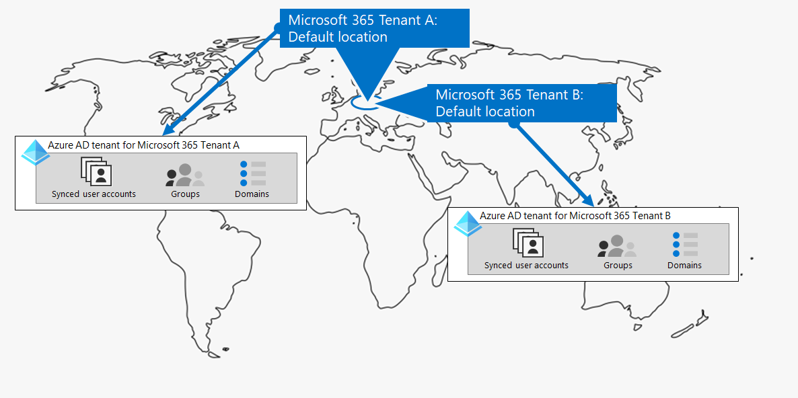
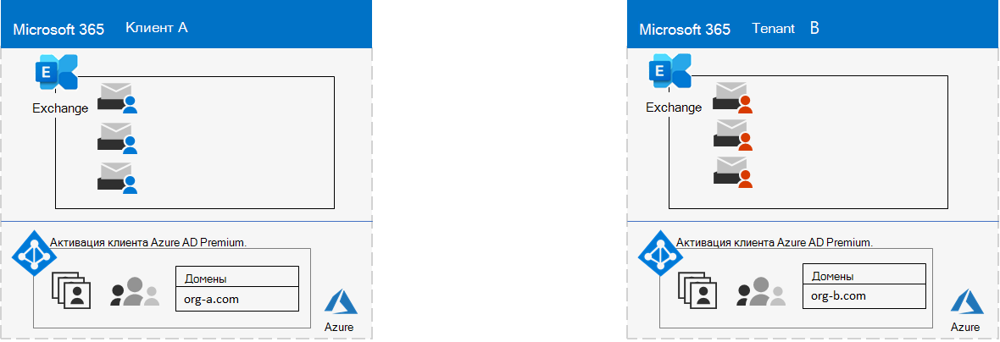
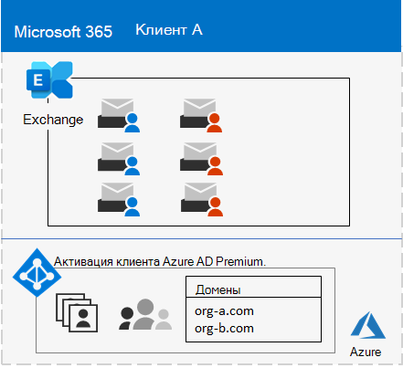
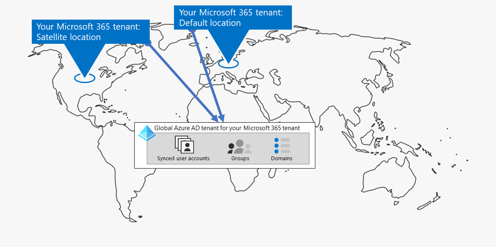
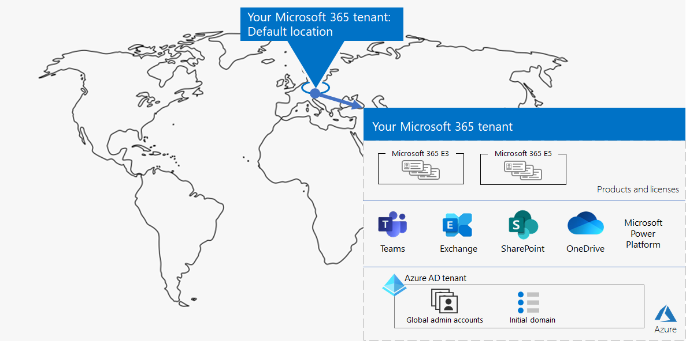
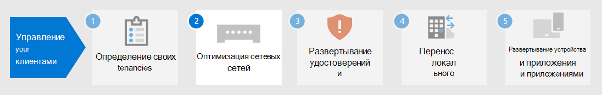

# Этап 1. Microsoft 365 для корпоративных клиентов

Одно из первых решений клиента — это количество клиентов. Каждый клиент Microsoft 365 отличается, уникален и отделен от всех других клиентов Microsoft 365. Соответствующий клиент Azure AD также отличается, уникален и отличается от всех остальных клиентов Microsoft 365.

## Единый клиент
Наличие одного клиента упрощает многие аспекты использования Microsoft 365 в организации. Один клиент означает одного клиента Azure AD с одним набором учетных записей, групп и политик. Разрешения и совместное использование ресурсов в организации можно сделать с помощью этого центрального поставщика удостоверений.

Один клиент предоставляет пользователям наиболее богатые функцией и упрощают совместную работу и производительность.

Вот пример расположения по умолчанию и клиента Azure AD клиента Microsoft 365.

## Несколько клиентов

Существует множество причин, по которым в организации может быть несколько клиентов:

- Административная изоляци
- Децентрализованная ИТ-система
- Исторические решения
- Слияния, приобретения или отгрузки
- Четкое разделение брендинга для организаций конгломератов
- Клиенты предварительного производства, тестирования или "песочницы"

Вот пример организации с двумя арендаторами (Tenant A и Tenant B) в одном и том же геоцентре данных по умолчанию. Каждый клиент в качестве отдельного клиента Azure AD.

Если у вас несколько клиентов, существуют ограничения и дополнительные соображения при управлении ими и предоставлении услуг пользователям.

### Взаимодействие между клиентами

Если вы хотите, чтобы пользователи могли более эффективно взаимодействовать с различными клиентами Microsoft 365 безопасным образом, варианты совместной работы между клиентами включают использование центрального расположения для файлов и бесед, совместное использование календарей, использование вызовов обмена мгновенными данными, аудио- и видеосвязи и обеспечение доступа к ресурсам и приложениям.

Дополнительные сведения см. в совместной работе [между клиентами Microsoft 365.](../enterprise/microsoft-365-inter-tenant-collaboration.md)

### Миграция почтовых ящиков с перекрестным клиентом (предварительный просмотр)

Перед перекрестной миграцией почтовых ящиков клиента (в предварительном режиме) при перемещении почтовых ящиков Exchange Online между клиентами необходимо полностью отключить почтовый ящик пользователя от текущего клиента (клиента-источника) к локальному, а затем к новому клиенту (целевому клиенту). С помощью новой функции миграции почтовых ящиков между клиентами администраторы клиентов в исходных и целевых клиентах могут перемещать почтовые ящики между арендаторами с минимальными зависимостями инфраструктуры в локальной системе. Это устраняет необходимость в бортовых и бортовых почтовых ящиках.

Вот два примера клиентов и их почтовых ящиков перед миграцией почтовых ящиков между клиентом.

На этой иллюстрации два отдельных клиента имеют собственные домены и набор почтовых ящиков Exchange.

Вот целевой клиент (Tenant A) после миграции почтовых ящиков между клиентом.

На этом рисунке один клиент имеет как домены, так и оба набора почтовых ящиков Exchange.

Дополнительные сведения см. в [перекрестной миграции почтовых ящиков клиента.](../enterprise/cross-tenant-mailbox-migration.md)

### Миграция между клиентами

Существует несколько архитектурных подходов для слияний, приобретений, сделок и других сценариев, которые могут привести к переносу существующего клиента Microsoft 365 в нового клиента. 

Подробные сведения см. в описании миграции клиента от клиента к арендатору в [Microsoft 365.](../enterprise/microsoft-365-tenant-to-tenant-migrations.md)

## Multi-Geo для клиента

С помощью Microsoft 365 Multi-Geo вы можете хранить данные в других географических расположениях центра обработки данных, которые вы выбрали для удовлетворения требований оседлости данных, и в то же время разблокировать глобальное предоставление рабочим современного опыта по повышению производительности.

В среде Multi-Geo клиент Microsoft 365 состоит из расположения по умолчанию или центра, где изначально была создана подписка microsoft 365, а также одно или несколько спутниковых расположений. В клиенте с несколькими географическими данными сведения о географических расположениях, группах и сведениях пользователей освояются в глобальном клиенте Azure AD. Поскольку сведения об клиентах освояются централизованно и синхронизируются в каждом географическом расположении, опыт совместной работы с кем-либо из вашей компании передается по всем расположениям.

Вот пример организации, которая имеет свое расположение по умолчанию в Европе и спутниковое расположение в Северной Америке. Оба расположения имеют один и тот же глобальный клиент Azure AD для одного клиента Microsoft 365.

Дополнительные сведения см. на странице [Microsoft 365 Multi-Geo](../enterprise/microsoft-365-multi-geo.md).

## Перемещение основных данных в новый геоцентр обработки данных

Корпорация Майкрософт продолжает открывать новые геоцентры центра обработки данных для служб Microsoft 365. Эти новые геоцентры данных добавляют мощности и вычислительные ресурсы для поддержки текущего спроса клиентов и роста использования. Кроме того, новые геоцентры центра обработки данных предоставляют резидентство данных для основных данных клиентов.

Несмотря на то, что открытие нового геоцентра данных не влияет на вас и основные данные, хранимые в уже существующем геоцентре данных, Корпорация Майкрософт позволяет запрашивать ранний перенос основных данных клиентов организации в остальное время в новый геоцентр обработки данных.

Вот пример, в котором клиент Microsoft 365 был перемещен из центра обработки данных Европейского союза (ЕС) в центр данных, расположенный в Соединенном Королевстве (Великобритания).

Дополнительные сведения см. в дополнительных сведениях о перемещении основных данных в новые геоцентры центра обработки данных Microsoft [365.](../enterprise/moving-data-to-new-datacenter-geos.md)

## Продукты и лицензии для клиента

Клиент Microsoft 365 создается при покупке первого продукта, например Microsoft 365 E3. Наряду с продуктом имеются лицензии, с которых взимается ежемесячная или годовая плата. Затем администратор назначает доступную лицензию от одного из ваших продуктов учетной записи пользователя непосредственно или через членство в группе. В зависимости от бизнес-потребностей организации у вас может быть набор продуктов, каждый из которых имеет собственный пул лицензий. 

Определение набора продуктов и количества лицензий для каждого из них требует определенного планирования:

- Убедитесь, что у вас достаточно лицензий для учетных записей пользователей, которые нуждаются в расширенных функций.
- Запретить вам убегать от лицензий или иметь слишком много ненаписаных лицензий на основе изменений в штатном расписыве в организации.

## Результаты этапа 1

Для клиента Microsoft 365 для корпоративных клиентов вы определили:

- Сколько клиентов у вас есть или требуется.
- Для каждого клиента, какие продукты и лицензии необходимо приобрести.
- Должен ли клиент быть multi-Geo, чтобы соответствовать требованиям оседлости данных.
- Необходимо ли настроить совместную работу между арендаторами.
- Необходимо ли перенести одного клиента на другой.
- Необходимо ли переместить основные данные из одного центра обработки данных в новый.

Вот пример нового клиента.

На этой иллюстрации у клиента есть:

- Расположение по умолчанию, соответствующее геоцентру данных Microsoft 365.
- Набор продуктов и лицензий.
- Набор приложений облачной производительности, некоторые из которых специфично для продуктов.
- Клиент Azure AD, содержащий глобальные учетные записи администратора и начальное доменное имя DNS.

При переходе к дополнительным шагам этого решения мы создам эту фигуру.

## Текущее обслуживание клиентов

На постоянной основе может потребоваться:

- Добавьте нового клиента.
- Добавьте новые продукты в клиента с начальным числом лицензий.
- Измените набор лицензий для продукта в клиенте, чтобы изменить требования к персоналу.
- Переместите основные данные из клиента в новое геолокационное расположение центра обработки данных.
- Добавьте Multi-Geo для требований к оседлости данных.
- Настройка междометной совместной работы.

## Следующий этап

Продолжайте работу [с сетью,](tenant-management-networking.md) чтобы обеспечить оптимальную сеть от сотрудников до облачных служб Microsoft 365.
