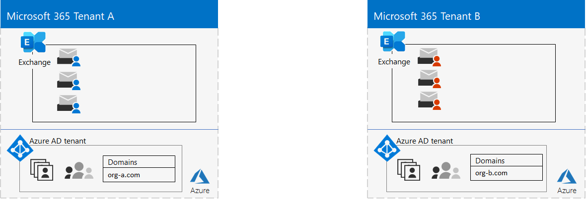

# Этап 1. Клиенты Microsoft 365 для предприятий

Одно из первых решений клиента — количество клиентов. Каждый клиент Microsoft 365 является уникальным и отделен от всех остальных клиентов Microsoft 365. Соответствующий клиент Azure AD также отличается, уникален и отделен от всех остальных клиентов Microsoft 365.

## Один клиент
Наличие одного клиента упрощает многие аспекты использования Microsoft 365 в организации. Под одним клиентом подразумевается один клиент Azure AD с одним набором учетных записей, групп и политик. Разрешения и общий доступ к ресурсам в организации можно получить с помощью этого центрального поставщика удостоверений.

Один клиент предоставляет пользователям наиболее богатые функции и упрощает совместную работу и производительность.

Ниже показан пример расположения по умолчанию и клиента Azure AD клиента Microsoft 365.

## Несколько клиентов

Существует множество причин, по которым в организации может быть несколько клиентов:

- Административная изоляци
- Децентрализованная ИТ-система
- Исторические решения
- Слияния, приобретения или инквизиалы
- Четкое разделение фирменности для организаций-конгломератов
- Предварительные, тестовые или "песочницы" клиенты

Вот пример организации, которая имеет два клиента (клиент A и клиент Б) в одном географическом центре обработки данных по умолчанию. Каждый клиент в качестве отдельного клиента Azure AD.

Если у вас несколько клиентов, при управлении ими и предоставлении услуг пользователям существуют ограничения и дополнительные соображения.

### Взаимодействие между клиентами

Чтобы обеспечить надежную совместную работу пользователей в разных клиентах Microsoft 365, можно использовать централизованное расположение для файлов и бесед, общий доступ к календарям, обмен мгновенными сообщениями, аудио- и видеозвонки для общения и обеспечение безопасности доступа к ресурсам и приложениям.

Дополнительные сведения см. в [совместной работе между клиентами Microsoft 365.](../enterprise/microsoft-365-inter-tenant-collaboration.md)

### Миграция почтовых ящиков между клиентами (предварительная версия)

Перед миграцией почтовых ящиков между клиентами (в предварительной версии) при перемещении почтовых ящиков Exchange Online между клиентами необходимо полностью отключить почтовый ящик пользователя от текущего клиента (клиента-источника) к локальному, а затем ввести их в новый клиент (целевой клиент). С помощью новой функции миграции почтовых ящиков между клиентами администраторы клиентов в исходных и целевых клиентах могут перемещать почтовые ящики между клиентами с минимальными зависимостями инфраструктуры в своих локальной системе. Это устраняет необходимость в отходящих и входящих почтовых ящиках.

Вот два примера клиентов и их почтовых ящиков перед миграцией почтовых ящиков между клиентами.

На этой иллюстрации два отдельных клиента имеют собственные домены и набор почтовых ящиков Exchange.

Вот целевой клиент (клиент А) после миграции почтовых ящиков между клиентами.

На этом рисунке у одного клиента есть как домены, так и оба набора почтовых ящиков Exchange.

Дополнительные сведения см. в [перекрестной миграции почтовых ящиков.](../enterprise/cross-tenant-mailbox-migration.md)

### Миграция между клиентами

Существует несколько архитектурных подходов для слияний, приобретений, сделок и других сценариев, которые могут привести к переносу существующего клиента Microsoft 365 в новый. 

Подробные инструкции см. в описании миграции между клиентами [Microsoft 365.](../enterprise/microsoft-365-tenant-to-tenant-migrations.md)

## Multi-Geo для клиента

С помощью Microsoft 365 с несколькими регионами вы можете хранить неачные данные в других географических расположениях центров обработки данных, выбранных для удовлетворения требований к месту расположения данных, и в то же время разблокировать глобальное предоставление современных рабочих мест сотрудникам.

В среде с несколькими регионами клиент Microsoft 365 состоит из расположения по умолчанию или центрального расположения, в котором изначально была создана подписка на Microsoft 365, и одного или нескольких дополнительных расположений. В клиенте с несколькими регионами сведения о географических расположениях, группах и пользовательских данных освояются в глобальном клиенте Azure AD. Так как сведения о клиенте централизованно и синхронизируются в каждом географическом расположении, взаимодействие совместной работы с любыми клиентами из вашей компании совместно работает в разных расположениях.

Вот пример организации с расположением по умолчанию в Европе и с дополнительным расположением в Северной Америке. В обоих расположениях имеется один глобальный клиент Azure AD для одного клиента Microsoft 365.

Дополнительные сведения см. на странице [Microsoft 365 Multi-Geo](../enterprise/microsoft-365-multi-geo.md).

## Перемещение основных данных в новый геоцентр данных

Корпорация Майкрософт продолжает открывать новые геоцентры для служб Microsoft 365. Эти новые геостойки центра обработки данных добавляют мощности и вычислительные ресурсы для поддержки текущего роста потребностей клиентов и роста использования. Кроме того, новые геополии центра обработки данных обеспечивают географическое место хранения данных для основных данных клиента.

Хотя открытие нового географического центра обработки данных не влияет на вас и основные данные, хранимые в уже существующем географическом центре данных, Корпорация Майкрософт позволяет запросить ранний перенос основных данных клиентов организации в новый геоо центр обработки данных.

Вот пример, в котором клиент Microsoft 365 был перемещен из географического центра обработки данных Европейского Союза (ЕС) в соединенное Королевство.

Дополнительные сведения см. в перемещении основных данных в новые географические области центра обработки данных [Microsoft 365.](../enterprise/moving-data-to-new-datacenter-geos.md)

## Продукты и лицензии для клиента

Клиент Microsoft 365 создается при покупке первого продукта, например Microsoft 365 E3. Наряду с продуктом это лицензии, с которых взимается ежемесячная или годовая плата. Затем администратор назначает доступную лицензию из одного из ваших продуктов учетной записи пользователя напрямую или через членство в группах. В зависимости от бизнес-потребностей организации у вас может быть набор продуктов, каждый из которых имеет собственный пул лицензий. 

Определение набора продуктов и количества лицензий для каждого из них требует определенного планирования:

- Убедитесь, что у вас достаточно лицензий для учетных записей пользователей, которые нуждаются в расширенных функций.
- Запретить вам неиссякание лицензий или слишком много ненаписаных лицензий в зависимости от изменений в персонале организации.

## Результаты этапа 1

Для корпоративных клиентов Microsoft 365 вы определили:

- Количество клиентов, которые у вас есть или необходимы.
- Для каждого клиента, какие продукты и лицензии необходимо приобрести.
- Сведения о том, должен ли клиент быть клиентом с несколькими географическими потребностями в соответствии с требованиями к месту хранения данных.
- Нужно ли настроить совместную работу между клиентами.
- Нужно ли перенести один клиент в другой.
- Нужно ли перемещать основные данные из одного географического центра обработки данных в новый.

Вот пример нового клиента.

На этой иллюстрации клиент имеет:

- Расположение по умолчанию, соответствующее географическому расположению центра обработки данных Microsoft 365.
- Набор продуктов и лицензий.
- Набор облачных приложений для повышения производительности, некоторые из которых специфично для продуктов.
- Клиент Azure AD, содержащий учетные записи глобального администратора и начальное доменное имя DNS.

По мере того как мы проймем дополнительные шаги этого решения, мы создаим этот рисунок.

## Текущее обслуживание клиентов

На постоянной основе может потребоваться:

- Добавление нового клиента.
- Добавление новых продуктов в клиент с начальным количеством лицензий.
- Измените набор лицензий для продукта в клиенте, чтобы изменить требования к персоналу.
- Переместите основные данные из клиента в новое географическое расположение центра обработки данных.
- Добавьте multi-Geo для требований к месту хранения данных.
- Настройка совместной работы между арендаторами.

## Следующий этап

Продолжайте работу [с сетью,](tenant-management-networking.md) чтобы обеспечить оптимальную сеть от сотрудников к облачным службам Microsoft 365.
