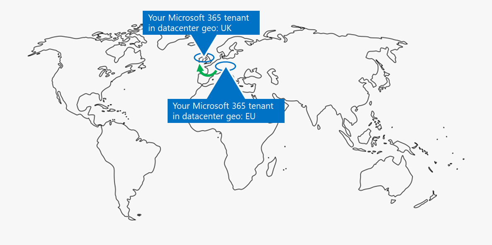

# Этап 1.Step 1. Клиенты Microsoft 365 для предприятийYour Microsoft 365 for enterprise tenants

Одно из первых решений клиента — количество клиентов.One of your first tenant decisions is how many to have. Каждый клиент Microsoft 365 является уникальным и отделен от всех остальных клиентов Microsoft 365.Each Microsoft 365 tenant is distinct, unique, and separate from all other Microsoft 365 tenants. Соответствующий клиент Azure AD также отличается, уникален и отделен от всех остальных клиентов Microsoft 365.It’s corresponding Azure AD tenant is also distinct, unique, and separate from all other Microsoft 365 tenants.

## Один клиентSingle tenant
Наличие одного клиента упрощает многие аспекты использования Microsoft 365 в организации.Having a single tenant simplifies many aspects of your organization’s use of Microsoft 365. Под одним клиентом подразумевается один клиент Azure AD с одним набором учетных записей, групп и политик.A single tenant means a single Azure AD tenant with a single set of accounts, groups, and policies. Разрешения и общий доступ к ресурсам в организации можно получить с помощью этого центрального поставщика удостоверений.Permissions and sharing of resources across your organization can be done through this central identity provider.

Один клиент предоставляет пользователям наиболее богатые функции и упрощает совместную работу и производительность.A single tenant provides the most feature-rich and simplified collaboration and productivity experience for your users.

Ниже показан пример расположения по умолчанию и клиента Azure AD клиента Microsoft 365.Here is an example showing the default location and Azure AD tenant of a Microsoft 365 tenant.

## Несколько клиентовMultiple tenants

Существует множество причин, по которым в организации может быть несколько клиентов:There are many reasons why your organization could have multiple tenants:

- Административная изоляциAdministrative isolation
- Децентрализованная ИТ-системаDecentralized IT
- Исторические решенияHistorical decisions
- Слияния, приобретения или инквизиалыMergers, acquisitions, or divestitures
- Четкое разделение фирменности для организаций-конгломератовClear separation of branding for conglomerate organizations
- Предварительные, тестовые или "песочницы" клиентыPre-production, test, or sandbox tenants

Вот пример организации, которая имеет два клиента (клиент A и клиент Б) в одном географическом центре обработки данных по умолчанию.Here is an example of an organization that has two tenants (Tenant A and Tenant B) in the same default datacenter geo. Каждый клиент в качестве отдельного клиента Azure AD.Each tenant as a separate Azure AD tenant.

Если у вас несколько клиентов, при управлении ими и предоставлении услуг пользователям существуют ограничения и дополнительные соображения.When you have multiple tenants, there are restrictions and additional considerations when managing them and providing services to your users.

### Взаимодействие между клиентамиInter-tenant collaboration

Чтобы обеспечить надежную совместную работу пользователей в разных клиентах Microsoft 365, можно использовать централизованное расположение для файлов и бесед, общий доступ к календарям, обмен мгновенными сообщениями, аудио- и видеозвонки для общения и обеспечение безопасности доступа к ресурсам и приложениям.If you want your users to collaborate more effectively across different Microsoft 365 tenants in a secure manner, inter-tenant collaboration options include using a central location for files and conversations, sharing calendars, using IM, audio/video calls for communication, and securing access to resources and applications.

Дополнительные сведения см. в [совместной работе между клиентами Microsoft 365.](../enterprise/microsoft-365-inter-tenant-collaboration.md)For more information, see [Microsoft 365 inter-tenant collaboration](../enterprise/microsoft-365-inter-tenant-collaboration.md).

### Миграция почтовых ящиков между клиентами (предварительная версия)Cross-tenant mailbox migration (preview)

Перед миграцией почтовых ящиков между клиентами (в предварительной версии) при перемещении почтовых ящиков Exchange Online между клиентами необходимо полностью отключить почтовый ящик пользователя от текущего клиента (клиента-источника) к локальному, а затем ввести их в новый клиент (целевой клиент).Prior to cross-tenant mailbox migration (in preview), when moving Exchange Online mailboxes between tenants, you have to completely offboard a user mailbox from their current tenant (the source tenant) to on-premises and then onboard them to a new tenant (the target tenant). С помощью новой функции миграции почтовых ящиков между клиентами администраторы клиентов в исходных и целевых клиентах могут перемещать почтовые ящики между клиентами с минимальными зависимостями инфраструктуры в своих локальной системе.With the new cross-tenant mailbox migration feature, tenant administrators in both source and target tenants can move mailboxes between the tenants with minimal infrastructure dependencies in their on-premises systems. Это устраняет необходимость в отходящих и входящих почтовых ящиках.This removes the need to off-board and onboard mailboxes.

Вот два примера клиентов и их почтовых ящиков перед миграцией почтовых ящиков между клиентами.Here are two example tenants and their mailboxes before cross-tenant mailbox migration.

На этой иллюстрации два отдельных клиента имеют собственные домены и набор почтовых ящиков Exchange.In this illustration, two separate tenants have their own domains and set of Exchange mailboxes.

Вот целевой клиент (клиент А) после миграции почтовых ящиков между клиентами.Here is the target tenant (Tenant A) after cross-tenant mailbox migration.

На этом рисунке у одного клиента есть как домены, так и оба набора почтовых ящиков Exchange.In this illustration, a single tenant has both domains and both sets of Exchange mailboxes.

Дополнительные сведения см. в [перекрестной миграции почтовых ящиков.](../enterprise/cross-tenant-mailbox-migration.md)For more information, see [Cross-tenant mailbox migration](../enterprise/cross-tenant-mailbox-migration.md).

### Миграция между клиентамиTenant-to-tenant migrations

Существует несколько архитектурных подходов для слияний, приобретений, сделок и других сценариев, которые могут привести к переносу существующего клиента Microsoft 365 в новый.There are several architectural approaches for mergers, acquisitions, divestitures, and other scenarios that might lead you to migrate an existing Microsoft 365 tenant to a new tenant. 

Подробные инструкции см. в описании миграции между клиентами [Microsoft 365.](../enterprise/microsoft-365-tenant-to-tenant-migrations.md)For detailed guidance, see [Microsoft 365 tenant-to-tenant migrations](../enterprise/microsoft-365-tenant-to-tenant-migrations.md).

## Multi-Geo для клиентаMulti-Geo for a tenant

С помощью Microsoft 365 с несколькими регионами вы можете хранить неачные данные в других географических расположениях центров обработки данных, выбранных для удовлетворения требований к месту расположения данных, и в то же время разблокировать глобальное предоставление современных рабочих мест сотрудникам.With Microsoft 365 Multi-Geo, you can provision and store data at rest in the other datacenter geo locations that you've chosen to meet data residency requirements, and at the same time unlock your global rollout of modern productivity experiences to your workers.

В среде с несколькими регионами клиент Microsoft 365 состоит из расположения по умолчанию или центрального расположения, в котором изначально была создана подписка на Microsoft 365, и одного или нескольких дополнительных расположений.In a Multi-Geo environment, your Microsoft 365 tenant consists of a default or central location where your Microsoft 365 subscription was originally created and one or more satellite locations. В клиенте с несколькими регионами сведения о географических расположениях, группах и пользовательских данных освояются в глобальном клиенте Azure AD.In a multi-geo tenant, the information about geo locations, groups, and user information is mastered in a global Azure AD tenant. Так как сведения о клиенте централизованно и синхронизируются в каждом географическом расположении, взаимодействие совместной работы с любыми клиентами из вашей компании совместно работает в разных расположениях.Because your tenant information is mastered centrally and synchronized into each geo location, collaboration experiences involving anyone from your company are shared across the locations.

Вот пример организации с расположением по умолчанию в Европе и с дополнительным расположением в Северной Америке.Here is an example of an organization that has its default location in Europe and a satellite location in North America. В обоих расположениях имеется один глобальный клиент Azure AD для одного клиента Microsoft 365.Both locations share the same global Azure AD tenant for the single Microsoft 365 tenant.

Дополнительные сведения см. на странице [Microsoft 365 Multi-Geo](../enterprise/microsoft-365-multi-geo.md).For more information, see [Microsoft 365 Multi-Geo](../enterprise/microsoft-365-multi-geo.md).

## Перемещение основных данных в новый геоцентр данныхMoving core data to a new datacenter geo

Корпорация Майкрософт продолжает открывать новые геоцентры для служб Microsoft 365.Microsoft continues to open new datacenter geos for Microsoft 365 services. Эти новые геостойки центра обработки данных добавляют мощности и вычислительные ресурсы для поддержки текущего роста потребностей клиентов и роста использования.These new datacenter geos add capacity and compute resources to support our ongoing customer demand and usage growth. Кроме того, новые геополии центра обработки данных обеспечивают географическое место хранения данных для основных данных клиента.Additionally, the new datacenter geos offer in-geo data residency for core customer data.

Хотя открытие нового географического центра обработки данных не влияет на вас и основные данные, хранимые в уже существующем географическом центре данных, Корпорация Майкрософт позволяет запросить ранний перенос основных данных клиентов организации в новый геоо центр обработки данных.Although opening a new datacenter geo does not impact you and your core data stored in an already existing datacenter geo, Microsoft allows you to request an early migration of your organization's core customer data at rest to a new datacenter geo.

Вот пример, в котором клиент Microsoft 365 был перемещен из географического центра обработки данных Европейского Союза (ЕС) в соединенное Королевство.Here is an example in which a Microsoft 365 tenant was moved from the European Union (EU) datacenter geo to the one located in the United Kingdom (UK).

Дополнительные сведения см. в перемещении основных данных в новые географические области центра обработки данных [Microsoft 365.](../enterprise/moving-data-to-new-datacenter-geos.md)For more information, see [Moving core data to new Microsoft 365 datacenter geos](../enterprise/moving-data-to-new-datacenter-geos.md).

## Продукты и лицензии для клиентаProducts and licenses for a tenant

Клиент Microsoft 365 создается при покупке первого продукта, например Microsoft 365 E3.Your Microsoft 365 tenant gets created when you purchase your first product, such as Microsoft 365 E3. Наряду с продуктом это лицензии, с которых взимается ежемесячная или годовая плата.Along with the product are licenses, which are charged a monthly or annual fee. Затем администратор назначает доступную лицензию из одного из ваших продуктов учетной записи пользователя напрямую или через членство в группах.An administrator then assigns an available license from one of your products to a user account, either directly or through group membership. В зависимости от бизнес-потребностей организации у вас может быть набор продуктов, каждый из которых имеет собственный пул лицензий.Depending on your organization's business needs, you might have a set of products, each with their own pool of licenses. 

Определение набора продуктов и количества лицензий для каждого из них требует определенного планирования:Determining the set of products and the number of licenses for each requires some planning to:

- Убедитесь, что у вас достаточно лицензий для учетных записей пользователей, которые нуждаются в расширенных функций.Ensure you have enough licenses for the user accounts that need advanced features.
- Запретить вам неиссякание лицензий или слишком много ненаписаных лицензий в зависимости от изменений в персонале организации.Prevent you from running out of licenses or having too many unassigned licenses, based on changes in staffing at your organization.

## Результаты этапа 1Results of Step 1

Для корпоративных клиентов Microsoft 365 вы определили:For your Microsoft 365 for enterprise tenants, you have determined:

- Количество клиентов, которые у вас есть или необходимы.How many tenants you have or need.
- Для каждого клиента, какие продукты и лицензии необходимо приобрести.For each tenant, which products and licenses must be purchased.
- Сведения о том, должен ли клиент быть клиентом с несколькими географическими потребностями в соответствии с требованиями к месту хранения данных.Whether a tenant needs to be Multi-Geo to comply with data residency requirements.
- Нужно ли настроить совместную работу между клиентами.Whether you need to set up inter-tenant collaboration.
- Нужно ли перенести один клиент в другой.Whether you need to migrate one tenant to another.
- Нужно ли перемещать основные данные из одного географического центра обработки данных в новый.Whether you need to move core data from one datacenter geo to new one.

Вот пример нового клиента.Here is an example of a new tenant.

На этой иллюстрации клиент имеет:In this illustration, the tenant has:

- Расположение по умолчанию, соответствующее географическому расположению центра обработки данных Microsoft 365.A default location corresponding to a Microsoft 365 datacenter geo.
- Набор продуктов и лицензий.A set of products and licenses.
- Набор облачных приложений для повышения производительности, некоторые из которых специфично для продуктов.The set of cloud productivity apps, some of which are specific to products.
- Клиент Azure AD, содержащий учетные записи глобального администратора и начальное доменное имя DNS.An Azure AD tenant that contains global administrator accounts and an initial DNS domain name.

По мере того как мы проймем дополнительные шаги этого решения, мы создаим этот рисунок.As we move through the additional steps of this solution, we will build out this figure.

## Текущее обслуживание клиентовOngoing maintenance for tenants

На постоянной основе может потребоваться:On an ongoing basis, you might need to:

- Добавление нового клиента.Add a new tenant.
- Добавление новых продуктов в клиент с начальным количеством лицензий.Add new products to a tenant with an initial number of licenses.
- Измените набор лицензий для продукта в клиенте, чтобы изменить требования к персоналу.Change the set of licenses for a product in a tenant to adjust for changing staff requirements.
- Переместите основные данные из клиента в новое географическое расположение центра обработки данных.Move your core data from a tenant to a new datacenter geo location.
- Добавьте multi-Geo для требований к месту хранения данных.Add Multi-Geo for data residency requirements.
- Настройка совместной работы между арендаторами.Set up inter-tenant collaboration.

## Следующий этапNext step

Продолжайте работу [с сетью,](tenant-management-networking.md) чтобы обеспечить оптимальную сеть от сотрудников к облачным службам Microsoft 365.Continue with [networking](tenant-management-networking.md) to provide optimal networking from your workers to Microsoft 365 cloud services.
