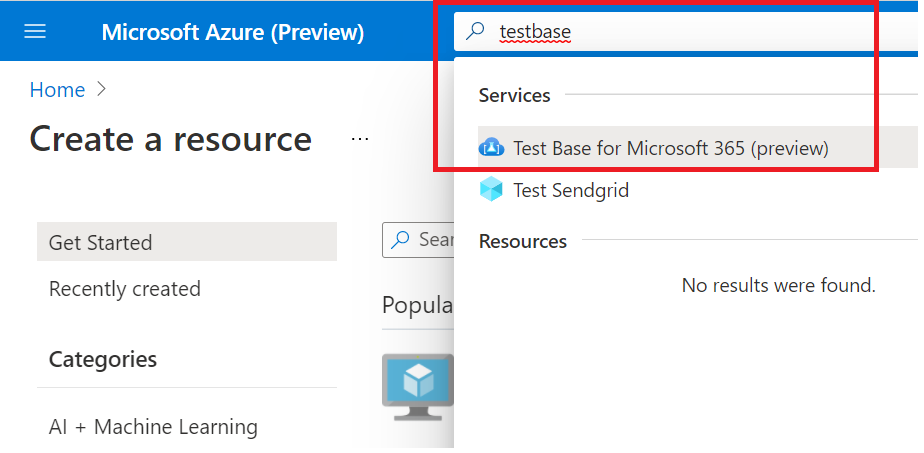

# <a name="step-1-create-a-test-base-account"></a>Шаг 1. Создание учетной записи тестовой базы

Если у вас нет подписки Azure, создайте бесплатную [учетную](https://azure.microsoft.com/en-us/free/) запись перед началом работы.

## <a name="enter-details-for-test-base-account"></a>Ввод сведений для учетной записи тестовой базы
 
1. Поиск **"Тестовая база"** на портале Azure.



2. Нажмите **кнопку "Добавить",** чтобы создать учетную запись тестовой базы.


3.  Прочитайте затем ```Terms of Use``` выберите почтовый ящик, чтобы подтвердить ваше удовлетворение ```Terms of Use``` с .


4.  Заполните правильные сведения в соответствии со следующими требованиями: 
    -   Подписка: ресурсная группа
    -   Сведения экземпляра. Имя.

**В настоящее время тестовая база поддерживает только уровень стандартного ценообразования.**


5.  Наконец, щелкните, ```Review + Create``` чтобы проверить и включить вновь созданную учетную запись.

## <a name="next-steps"></a>Дальнейшие действия

Чтобы приступить к работе со этапом 2: **Узнайте, как загрузить пакет.**
> [!div class="nextstepaction"]
> [Следующий этап](uploadApplication.md)

<!---
Add button for next page
-->
