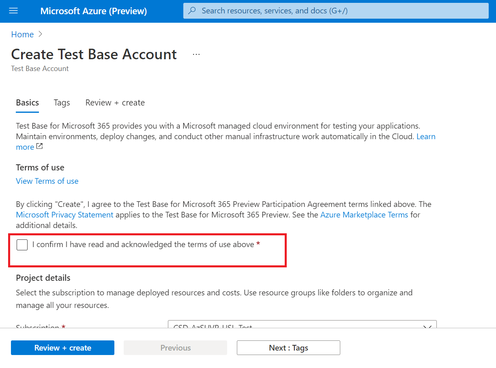

# <a name="step-1-create-a-test-base-account"></a><span data-ttu-id="34311-103">Шаг 1. Создание учетной записи тестовой базы</span><span class="sxs-lookup"><span data-stu-id="34311-103">Step 1: Create a Test Base account</span></span>

<span data-ttu-id="34311-104">Если у вас нет подписки Azure, создайте бесплатную [учетную](https://azure.microsoft.com/en-us/free/) запись перед началом работы.</span><span class="sxs-lookup"><span data-stu-id="34311-104">If you don't have an Azure subscription, create a [free account](https://azure.microsoft.com/en-us/free/) before you begin.</span></span>

## <a name="enter-details-for-test-base-account"></a><span data-ttu-id="34311-105">Ввод сведений для учетной записи тестовой базы</span><span class="sxs-lookup"><span data-stu-id="34311-105">Enter details for test base account</span></span>
 
1. <span data-ttu-id="34311-106">Поиск **"Тестовая база"** на портале Azure.</span><span class="sxs-lookup"><span data-stu-id="34311-106">Search for **'Test Base'** in the Azure portal.</span></span>


2. <span data-ttu-id="34311-108">Нажмите **кнопку "Добавить",** чтобы создать учетную запись тестовой базы.</span><span class="sxs-lookup"><span data-stu-id="34311-108">Click **'Add'** to create a Test Base account.</span></span>


3.  <span data-ttu-id="34311-110">Прочитайте затем ```Terms of Use``` выберите почтовый ящик, чтобы подтвердить ваше удовлетворение ```Terms of Use``` с .</span><span class="sxs-lookup"><span data-stu-id="34311-110">Read through the ```Terms of Use``` then select the checkbox to confirm your satisfaction with the ```Terms of Use```.</span></span>



4.  <span data-ttu-id="34311-112">Заполните правильные сведения в соответствии со следующими требованиями:</span><span class="sxs-lookup"><span data-stu-id="34311-112">Fill in the correct information under the following requirements:</span></span> 
    -   <span data-ttu-id="34311-113">Подписка: ресурсная группа</span><span class="sxs-lookup"><span data-stu-id="34311-113">Subscription: Resource Group</span></span>
    -   <span data-ttu-id="34311-114">Сведения экземпляра. Имя.</span><span class="sxs-lookup"><span data-stu-id="34311-114">Instance Details: Name.</span></span>

<span data-ttu-id="34311-115">**В настоящее время тестовая база поддерживает только уровень стандартного ценообразования.**</span><span class="sxs-lookup"><span data-stu-id="34311-115">**Currently, Test Base only supports Standard Pricing tier.**</span></span>


5.  <span data-ttu-id="34311-117">Наконец, щелкните, ```Review + Create``` чтобы проверить и включить вновь созданную учетную запись.</span><span class="sxs-lookup"><span data-stu-id="34311-117">Finally, click on ```Review + Create``` to validate and enable your newly created account.</span></span>

## <a name="next-steps"></a><span data-ttu-id="34311-118">Дальнейшие действия</span><span class="sxs-lookup"><span data-stu-id="34311-118">Next steps</span></span>

<span data-ttu-id="34311-119">Чтобы приступить к работе со этапом 2: **Узнайте, как загрузить пакет.**</span><span class="sxs-lookup"><span data-stu-id="34311-119">Advance to the next article to get started with Step 2: **Learn how upload your package.**</span></span>
> [!div class="nextstepaction"]
> [<span data-ttu-id="34311-120">Следующий этап</span><span class="sxs-lookup"><span data-stu-id="34311-120">Next step</span></span>](uploadApplication.md)

<!---
Add button for next page
-->
