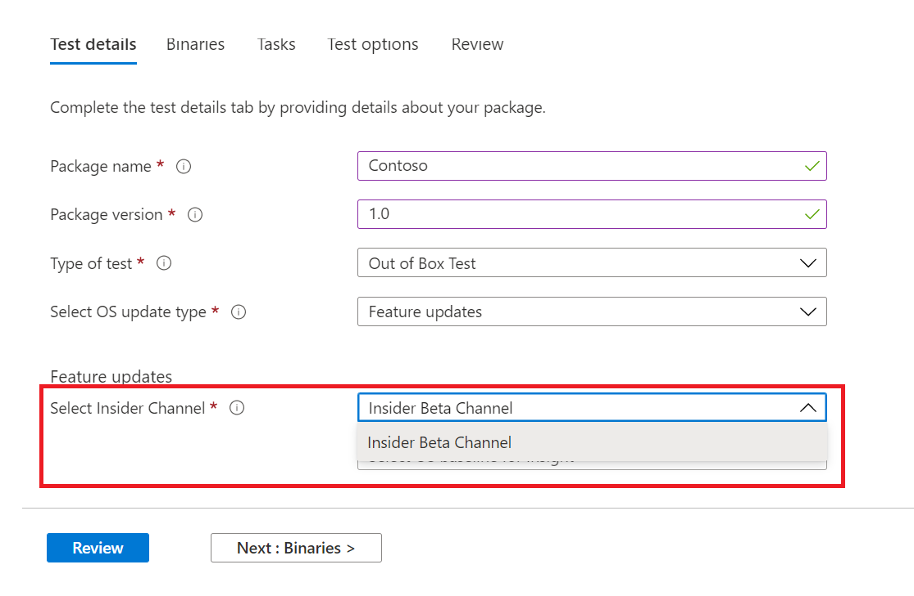
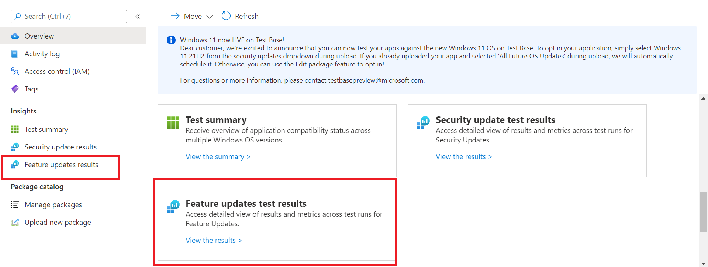

# <a name="windows-feature-update-validation"></a><span data-ttu-id="e43ce-103">Windows Проверка обновления функций</span><span class="sxs-lookup"><span data-stu-id="e43ce-103">Windows Feature update validation</span></span>

<span data-ttu-id="e43ce-104">Нужны ли сведения о том, как приложения будут выполняться при следующем выпуске Windows 10 или Windows 11 , без поддержания среды для проверки новых Windows функций?</span><span class="sxs-lookup"><span data-stu-id="e43ce-104">Do you need insights on how your applications will perform with the next release of Windows 10 or Windows 11 - without you maintaining an environment to validate new Windows features?</span></span> 

<span data-ttu-id="e43ce-105">Хотите выполнить тесты проверки с Windows в среде Azure?</span><span class="sxs-lookup"><span data-stu-id="e43ce-105">Do you want to run your validation tests against Windows Insider Program builds in our Azure environment?</span></span>

<span data-ttu-id="e43ce-106">**Проверка обновления** функций на тестовой базе для M365 поможет вам добиться всех этих и более результатов!</span><span class="sxs-lookup"><span data-stu-id="e43ce-106">**Feature update** validation on Test Base for M365 can help you achieve all these and more!</span></span>

<span data-ttu-id="e43ce-107">Ознакомьтесь с пошаговой схемой ниже, чтобы узнать, как получить доступ к этой новой возможности в тестовой базе для службы M365.</span><span class="sxs-lookup"><span data-stu-id="e43ce-107">Check out the step-by-step outline below to find out how to access this new capability in Test Base for M365 service.</span></span>

<span data-ttu-id="e43ce-108">Чтобы начать работу в тестовой базе для M365, загрузите приложения (и связанные файлы) через портал ```Feature update validation``` самообслуживки.</span><span class="sxs-lookup"><span data-stu-id="e43ce-108">To get started with ```Feature update validation``` in Test Base for M365, upload your applications (and related files) through the self-service onboarding portal.</span></span> 

<span data-ttu-id="e43ce-109">Ниже приведены действия, которые необходимо предпринять при заполнении сведений **о тесте:**</span><span class="sxs-lookup"><span data-stu-id="e43ce-109">Highlighted below are the steps to take as you fill out the **Test details**:</span></span>

1. <span data-ttu-id="e43ce-110">Выберите **обновление функций** в качестве типа обновления ОС:</span><span class="sxs-lookup"><span data-stu-id="e43ce-110">Select **Feature Update** as your OS update type:</span></span>


2. <span data-ttu-id="e43ce-112">Выберите канал Windows, на котором требуется проверка приложения.</span><span class="sxs-lookup"><span data-stu-id="e43ce-112">Choose the Windows Insider Channel against which you want your application validated.</span></span>  



3. <span data-ttu-id="e43ce-115">Выберите на рынке выпуск Windows 10 или Windows 11 в качестве базовой версии теста (и результатов анализа!), а также укайте другие сведения, необходимые для успешной работы на борту пакета.</span><span class="sxs-lookup"><span data-stu-id="e43ce-115">Select an in-market release of Windows 10 or Windows 11 as the baseline for your test (and resulting insights!) and provide the other details required to onboard your package successfully.</span></span>


4. <span data-ttu-id="e43ce-117">Чтобы просмотреть результаты проверки приложения в отношении предварительно выпущенных обновлений Windows 10 функций, посетите ```Feature Updates Test Results``` веб-сайт .</span><span class="sxs-lookup"><span data-stu-id="e43ce-117">To view the results from the validation of your application against pre-released Windows 10 feature updates, visit the ```Feature Updates Test Results```.</span></span>




## <a name="next-steps"></a><span data-ttu-id="e43ce-119">Дальнейшие действия</span><span class="sxs-lookup"><span data-stu-id="e43ce-119">Next steps</span></span>

<span data-ttu-id="e43ce-120">Следующую статью необходимо приступить к анализу регрессии памяти.</span><span class="sxs-lookup"><span data-stu-id="e43ce-120">Advance to the next article to get started with understanding Memory regression analysis.</span></span>
> [!div class="nextstepaction"]
> [<span data-ttu-id="e43ce-121">Следующий этап</span><span class="sxs-lookup"><span data-stu-id="e43ce-121">Next step</span></span>](memory.md)

<!---
Add button for next page
-->
