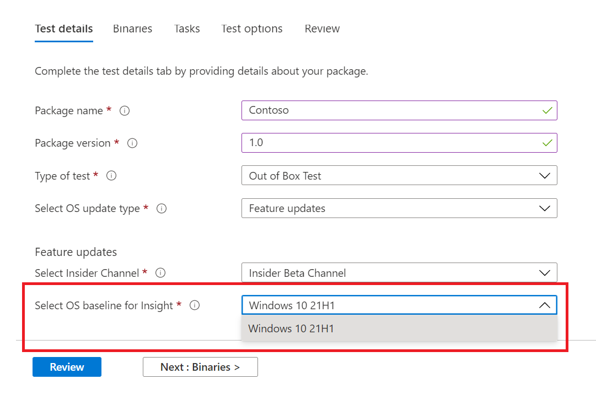

# <a name="windows-feature-update-validation"></a>Windows Проверка обновления функций

Нужны ли сведения о том, как приложения будут выполняться при следующем выпуске Windows 10 или Windows 11 , без поддержания среды для проверки новых Windows функций? 

Хотите выполнить тесты проверки с Windows в среде Azure?

**Проверка обновления** функций на тестовой базе для M365 поможет вам добиться всех этих и более результатов!

Ознакомьтесь с пошаговой схемой ниже, чтобы узнать, как получить доступ к этой новой возможности в тестовой базе для службы M365.

Чтобы начать работу в тестовой базе для M365, загрузите приложения (и связанные файлы) через портал ```Feature update validation``` самообслуживки. 

Ниже приведены действия, которые необходимо предпринять при заполнении сведений **о тесте:**

1. Выберите **обновление функций** в качестве типа обновления ОС:


2. Выберите канал Windows, на котором требуется проверка приложения.  


3. Выберите на рынке выпуск Windows 10 или Windows 11 в качестве базовой версии теста (и результатов анализа!), а также укайте другие сведения, необходимые для успешной работы на борту пакета.



4. Чтобы просмотреть результаты проверки приложения в отношении предварительно выпущенных обновлений Windows 10 функций, посетите ```Feature Updates Test Results``` веб-сайт .


## <a name="next-steps"></a>Дальнейшие действия

Следующую статью необходимо приступить к анализу регрессии памяти.
> [!div class="nextstepaction"]
> [Следующий этап](memory.md)

<!---
Add button for next page
-->
