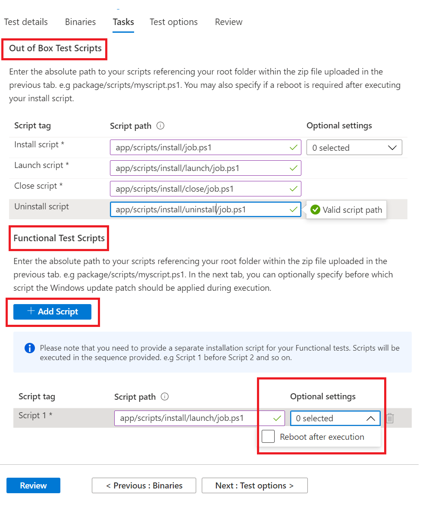

# <a name="step-4-the-tasks-tab"></a><span data-ttu-id="c3915-103">Шаг 4. Вкладка задач</span><span class="sxs-lookup"><span data-stu-id="c3915-103">Step 4: The tasks tab</span></span>

<span data-ttu-id="c3915-104">На вкладке задачи предполагается предоставить пути для тестовых скриптов, которые находятся в папке zip, которую вы загрузили на вкладке binaries.</span><span class="sxs-lookup"><span data-stu-id="c3915-104">On the tasks tab, you are expected to provide the paths to your test scripts which are in the zip folder you uploaded under the binaries tab.</span></span>

  - <span data-ttu-id="c3915-105">**Вне тестового скрипта box:** Введите относительные пути к сценариям установки, запуска, закрытия и списания.</span><span class="sxs-lookup"><span data-stu-id="c3915-105">**Out of Box Test Scripts:** Type in the relative paths to your install, launch, close and uninstall scripts.</span></span> <span data-ttu-id="c3915-106">Вы также можете выбрать дополнительные параметры для сценария установки.</span><span class="sxs-lookup"><span data-stu-id="c3915-106">You also have the option to select additional settings for the install script.</span></span>
  - <span data-ttu-id="c3915-107">**Функциональные тестовые скрипты:** Введите относительный путь к каждому загруженным функциональным тест-скриптам.</span><span class="sxs-lookup"><span data-stu-id="c3915-107">**Functional Test Scripts:** Type in the relative path to each functional test script uploaded.</span></span> <span data-ttu-id="c3915-108">С помощью кнопки можно добавить дополнительные функциональные тестовые ```Add Script``` скрипты.</span><span class="sxs-lookup"><span data-stu-id="c3915-108">Additional functional test scripts can be added using the ```Add Script``` button.</span></span> <span data-ttu-id="c3915-109">Требуется как минимум один (1) скрипт, который может добавить до восьми (8) функциональных тестовых скриптов.</span><span class="sxs-lookup"><span data-stu-id="c3915-109">You need a minimum of one (1) script and can add up to eight (8) functional test scripts.</span></span> 
  
    <span data-ttu-id="c3915-110">Сценарии выполняются в последовательности отправки, а сбой в конкретном скрипте остановит выполнение последующих сценариев.</span><span class="sxs-lookup"><span data-stu-id="c3915-110">The scripts are run in upload sequence and a failure in a particular script will stop subsequent scripts from executing.</span></span>
    <span data-ttu-id="c3915-111">У вас также есть возможность выбора дополнительных параметров для каждого предоставленного сценария.</span><span class="sxs-lookup"><span data-stu-id="c3915-111">You also have the option of selecting additional settings for each script provided.</span></span>

## <a name="set-script-path"></a><span data-ttu-id="c3915-112">Настройка пути скрипта</span><span class="sxs-lookup"><span data-stu-id="c3915-112">Set script path</span></span>



<span data-ttu-id="c3915-114">Пример относительного пути в структуре папок приведен ниже:</span><span class="sxs-lookup"><span data-stu-id="c3915-114">Sample of how to provide the relative path on a folder structure is below:</span></span>

<span data-ttu-id="c3915-115">_**Zip_file_uploaded**_</span><span class="sxs-lookup"><span data-stu-id="c3915-115">_**Zip_file_uploaded**_</span></span>
~~~
├── file1.exe

├── ScriptX.ps1

├── folder1

│   ├── file3.exe

│   ├── script.ps1
~~~
  - <span data-ttu-id="c3915-116">**ScriptX.ps1** бы.</span><span class="sxs-lookup"><span data-stu-id="c3915-116">**ScriptX.ps1** would have.</span></span> <span data-ttu-id="c3915-117">_ScriptX.ps1_ как относительный путь.</span><span class="sxs-lookup"><span data-stu-id="c3915-117">_ScriptX.ps1_ as the relative path.</span></span>
  - <span data-ttu-id="c3915-118">**Script.ps1** будет иметь _папку1/script.ps1_ в качестве относительного пути.</span><span class="sxs-lookup"><span data-stu-id="c3915-118">**Script.ps1** would have _folder1/script.ps1_ as the relative path.</span></span>


## <a name="next-steps"></a><span data-ttu-id="c3915-119">Дальнейшие действия</span><span class="sxs-lookup"><span data-stu-id="c3915-119">Next steps</span></span>

<span data-ttu-id="c3915-120">Сведения о вкладке Тестовые параметры в следующей статье</span><span class="sxs-lookup"><span data-stu-id="c3915-120">View details of the Test Options tab in the next article</span></span> 
> [!div class="nextstepaction"]
> [<span data-ttu-id="c3915-121">Следующий этап</span><span class="sxs-lookup"><span data-stu-id="c3915-121">Next step</span></span>](testoptions.md)
